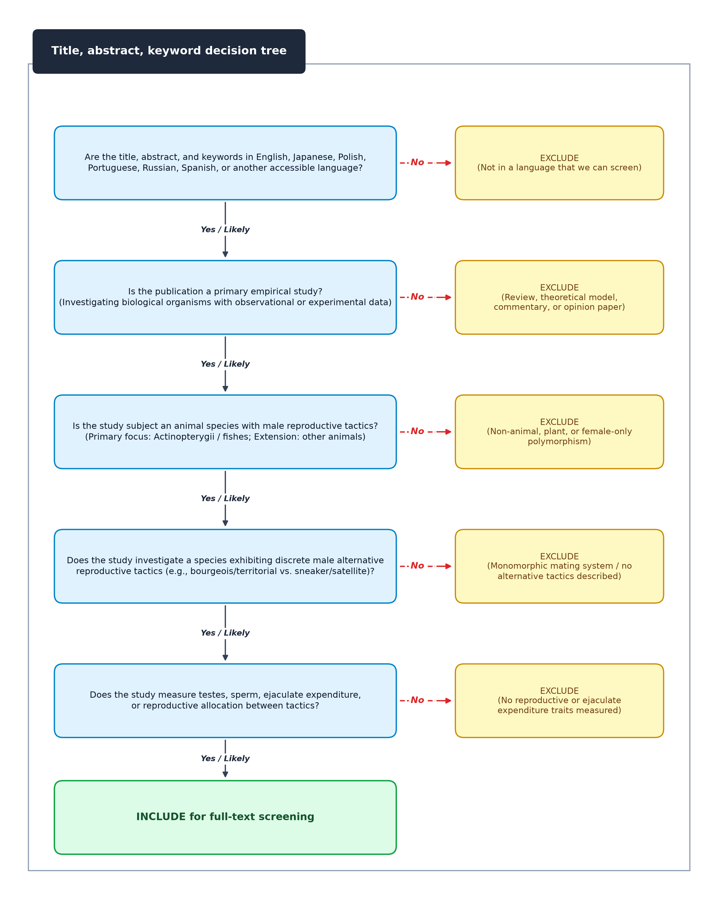
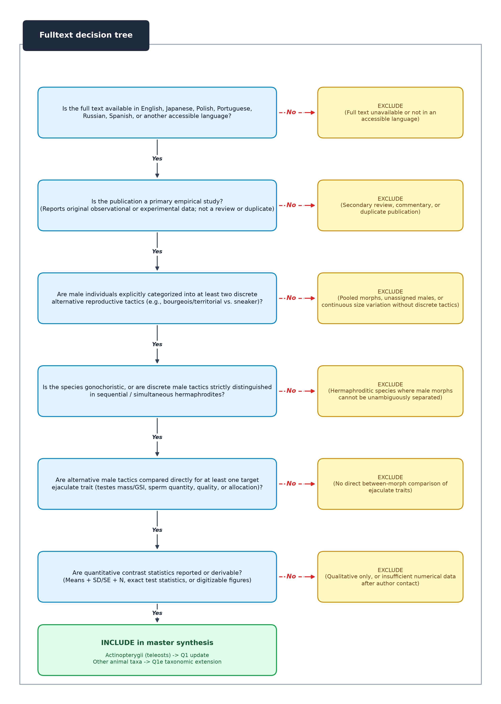

# 1. Study Protocol: Update of Del Matto (2018) and Reconciliation with Dougherty et al. (2022)

## 1.1. Version history

- **Version 0.2** (09 Sep, 2026) — Eduardo S. A. Santos
  - Comprehensive reconciliation of the protocol with the broad-taxa meta-analysis by Dougherty et al.
    [@doughertyMaleAlternativeReproductive2022], alongside the original Del Matto
    [@delmattoSpermCompetitionGames2018] MSc dissertation baseline. Formally structured into a three-way
    reconciliation framework: (1) **Q0a** reproduces the Del Matto (2018) baseline (50 teleost studies, 29
    species, 183 effect sizes reconciled from 207 raw rows via programmatic exclusion of 24 absolute gonad mass
    rows); (2) **Q0b** cross-checks and reconciles with Dougherty et al. (2022; 92 animal studies, 58 fish
    studies, with 31 shared studies, 19 teleost studies from Del Matto's fish-focused search, and 27 fish
    studies from Dougherty's broad-taxa search); and (3) **Q1** unites both datasets with post-2020 literature
    (harvested programmatically via the OpenAlex API pipeline `scripts/fetch_openalex.py`) into a definitive,
    fully reproducible publication. Formally incorporates continuous bivariate allometric modeling (Q1b) to address
    the methodological questions raised by Dougherty et al. regarding GSI ratio scaling, integrates behavioral
    per-spawn allocation (Q1c) alongside static traits, and implements quadratic polynomial meta-regression (Q1a)
    to test Parker's (1990) intermediate-risk prediction.
- **Version 0.1** (28 Jul, 2026) — Eduardo S. A. Santos
  - Initial draft of update protocol (adapted from the parallel `alien_predator_meta` and
    `mate_choice_meta` update protocols in this lab). Reproduce-then-update design adapted to an
    **unpublished MSc dissertation** with no archived data or code: **Q0** reconstructs the dataset from
    the dissertation's Supplementary Table 1 and re-implements the three `rma.mv` models; **Q1** updates
    the synthesis with roughly nine years of new evidence and contemporary multilevel methods, with the
    explicit aim of bringing the work to publication. Added the five lettered sub-questions (Q1a curvilinearity
    of the risk effect; Q1b gonad-investment allometry; Q1c the anomalous allocation reversal; Q1d tactic
    architecture and fertilisation mode; Q1e taxonomic generality beyond fishes), §2.2 interpretive-scope
    caveats, and a named Q0 step to confirm the **183-vs-207 effect-size count reconciliation** documented in
    [`01_summary_DelMatto_2018.md`](01_summary_DelMatto_2018.md) §7.

## 1.2. Title

Sperm competition games between majors and minors: protocol for the update, cross-synthesis reconciliation,
and publication of a meta-regression of species with alternative reproductive tactics.

## 1.3. Authors

- Lygia Aguiar Del Matto<sup>b</sup>, LADM, orcid: [TBD]
- Eduardo S. A. Santos<sup>1a</sup>, ESAS, orcid: 0000-0002-0434-3655
- [TBD — additional co-authors to be confirmed]

> **Note on authorship.** LADM is the author of the original, unpublished MSc dissertation
> [@delmattoSpermCompetitionGames2018] that this update reproduces and extends, and is therefore a
> co-author of the resulting publication. [Final author order: TBD.]

## 1.4. Affiliations

<sup>a</sup> Department of Biological Sciences, Faculty of Science, University of Alberta, Edmonton, AB, Canada

<sup>b</sup> Departamento de Zoologia, Instituto de Biociências, Universidade de São Paulo, São Paulo, SP,
Brazil [current affiliation: TBD]

<sup>1</sup> Corresponding author: esantos2@ualberta.ca

## 1.5. CRediT authorship contribution statement

- ESAS: Conceptualization, Methodology, Investigation, Data curation, Formal analysis, Visualization, Writing – original draft, Writing – review and editing, Supervision, Project administration, Funding acquisition.
- LADM: Conceptualization, Methodology, Investigation, Data curation, Formal analysis, Writing – review and editing.
- [TBD]

## 1.6. Declaration of Generative AI and AI-assisted technologies in the writing process

During the preparation of this work, the authors used AI-assisted tools to check grammar, spelling, and reference formatting, and to support code development. After using these tools, the authors carefully reviewed and edited the content as needed. The authors take full responsibility for the content of this report.

## 1.7. Data availability statement

All relevant data and analysis code will be made available in a publicly accessible repository (e.g., Borealis, https://borealisdata.ca/, and/or the Open Science Framework). This project provides four distinct open-science deliverables: (1) the machine-readable reconstructed and reconciled Del Matto (2018) baseline dataset (`data/input/delmatto2018_supp_table1.csv` and `data/output/delmatto2018_reconciled.csv`), resolving the 183-vs-207 effect-size count discrepancy; (2) the Dougherty et al. (2022) reconciled dataset (`data/input/dougherty2022_all_data.xlsx`), documenting study-level overlap and complementary coverage; (3) the automated OpenAlex literature retrieval pipeline (`scripts/fetch_openalex.py` and `data/output/openalex_update_candidates.csv`), enabling transparent forward citation chasing and Boolean query reproduction; and (4) the fully re-extracted master dataset with per-morph means, standard deviations, and exact sampling variances computed via `metafor::escalc`, accompanied by a curated ray-finned fish phylogeny and complete Typst/Python reproduction scripts. Remedying the original dissertation's reproducibility gap [see @rocheHowWellAre2015] while constructively building upon, reconciling, and updating recent synthetic benchmarks [@doughertyMaleAlternativeReproductive2022] is an explicit deliverable of this project.

## 1.8. Competing interests statement

The authors have declared that no competing interests exist.

## 1.9. Funding

[TBD — confirm funding sources. ESAS is supported by the Canada Excellence Research Chairs (CERC) program (grant number CERC-2022-00074). The original dissertation research was supported by CNPq and CAPES scholarships to LADM.]

---

# 2. Background

Sperm competition — competition among the ejaculates of different males for the fertilization of a female's
ova [@parkerSpermCompetitionIts1970] — is a pervasive selective force on male reproductive traits, and
**sperm competition game models** formalise how males should allocate resources to ejaculates under
different competitive scenarios [@parkerSpermCompetitionGamesRaffles1990; @parkerSpermCompetitionEvolution1998; @parkerSpermCompetitionGamesGeneral2012; @parkerPizzariSpermCompetitionEjaculate2010]. These models assume that sperm production is
costly [@dewsburyEjaculateCostMale1982; @wedellSpermCompetitionMale2002], that males trade off ejaculate
expenditure against mate acquisition [@kvarnemoSimmonsPolyandryMediator2013], and that greater expenditure
raises fertilization success. Species with **alternative reproductive tactics (ARTs)** offer an unusually
sharp test, because two male phenotypes within one population face structurally different competitive
regimes [@taborskySneakersSatellitesHelpers1994; @grossAlternativeReproductiveStrategies1996; @taborskyEvolutionAlternativeReproductive2008; @taborskyBrockmannAlternativeReproductive2010]. **Minors**
(sneakers, "parasitic" males) spawn inside another male's territory and should essentially always face sperm
competition; **majors** (guarders, "bourgeois" males) defend territories or females and face lower risk
[@taborskySpermCompetitionFish1998]. Parker's [-@parkerSpermCompetitionGamesSneaks1990] sneak–guard model
therefore predicts (i) **greater ejaculate expenditure by minors than majors**, and (ii) that as the
**frequency of minors rises**, majors converge on minors' expenditure — so the *difference* between tactics
is **greatest at intermediate** sperm competition and small at both extremes, i.e. a **hump-shaped**
relationship. Prior to 2018 the second prediction had been tested comparatively only within one beetle genus,
where it was not supported [@simmonsSpermCompetitionGames2007],
and evidence on testis investment and sperm quality in ART species was conflicting
[@smithRyanEvolutionSpermQuality2010; @simmonsSpermCompetitionGamesDimorphic1999;
@kellySpermInvestmentRelation2008; @snookSpermCompetitionNot2005].

Del Matto [@delmattoSpermCompetitionGames2018] provided the first cross-species meta-analytic test of both
predictions, in fishes. From searches of *Web of Knowledge* and *Scopus* last updated **16 May 2017** (868 +
682 records; 1,103 after deduplication; 205 title/abstract-eligible; **50 studies** retained), she estimated
**183 Hedges' *g*** effect sizes across **29 fish species**, with positive *g* meaning larger values in
majors. Response variables were sorted into **Production/GSI**, **Production/Quantity**, **Quality** and
**Allocation** categories, and each species was assigned a five-level **sperm competition rank (SCR)** based
on fertilization mode, pairing and group spawning, following the ranking of Stockley et al.
[@stockleySpermCompetitionFishes1997]. Three `metafor::rma.mv` models
[@viechtbauerConductingMetaanalysesMetafor2010] were fitted with study, species and phylogeny random effects.
The overall mean favoured minors but was not statistically resolved (**−0.519, 95% CI −1.317 to 0.278**;
*I*² = 83.21%). By variable type, **minors invested substantially more in GSI (−2.638, −3.105 to −2.177)**,
while **majors allocated significantly more sperm (+2.732, +1.476 to +3.989)** — the opposite of the
theoretical expectation; sperm **quantity** (−0.384, −0.845 to 0.076) and **quality** (−0.251, −0.699 to
0.197) did not differ. **SCR had little influence** on the size of the major–minor difference, and phylogeny
was dropped from both meta-regressions for explaining no variation. Egger's regression intercepts
[@eggerBiasMetaanalysisDetected1997] gave no indication of publication bias (−0.323, −0.338, −0.610; all
*p* > 0.28). A full summary is provided in
[`01_summary_DelMatto_2018.md`](01_summary_DelMatto_2018.md).

Several features make this work both a strong candidate for an update and an obligation to bring to
publication. First, **it was never published**: a first cross-taxon test of a foundational model of sperm
competition currently exists only as a São Paulo dissertation, invisible to the field's evidence base.
Second, **nothing was archived** — no data file, no code, no registration — so even the reproduction step
requires reconstructing the dataset from a PDF appendix. Third, that appendix does not carry the
quantities the analysis needs: **Supplementary Table 1 reports *g* and a single *N* per row but no per-morph
means, dispersions or group sample sizes**, so the inverse-variance weights that produced the published
estimates cannot be recovered exactly, only approximated. Fourth, **the reported dataset size differs from the
table's row count, though the difference is fully reconcilable**: the Results state 183 effect sizes, but the
table contains **207** data rows (after removing three PDF line-wrap artefacts) — the Quality (107) and
Allocation (11) counts match exactly, while Production is 89 rather than 65. Exactly **24** rows record an
**absolute gonad or testis mass or weight**, the very variables the Methods say were excluded "because they are
not independent from GSI"; excluding those 24 (and retaining body-mass-corrected indices such as `testes
corrected for body mass`, which the rule does not reach) recovers the reported counts **exactly** — 183 total,
65 Production, 31 GSI, 34 Quantity. Supplementary Table 1 is therefore the complete extraction sheet, and the
analysed dataset is reconstructible; confirming this in code is a named step of Q0 below. Fifth, **eight rows
carry implausible effect sizes** (|*g*| > 8, up to |*g*| = 78.6), which no outlier or influence analysis
interrogated. Sixth, the **search ended in May 2017**, predating roughly nine years of primary literature and a
substantial theoretical and synthetic re-examination of sperm competition in ART species
[@kustraAlonzoSpermAlternativeReproductive2023; @lupoldHowSpermCompetition2020].

Crucially, the empirical and theoretical landscape advanced substantially with the publication of a landmark broad-taxa meta-analysis by Dougherty et al. [@doughertyMaleAlternativeReproductive2022], which synthesized 92 studies across 67 animal species (including 58 fish studies) with searches concluding in late 2020. Dougherty et al. provided the first comprehensive animal-wide evaluation of male alternative reproductive tactics, concluding that evidence for ejaculate divergence across animals was subtle, and constructively highlighting that gonadosomatic index (GSI) ratios can introduce scaling artifacts when male morphs differ markedly in body size [@tomkinsMeasuringRelativeInvestment2002].

The existence of Dougherty et al.'s [@doughertyMaleAlternativeReproductive2022] synthesis alongside Del Matto's [@delmattoSpermCompetitionGames2018] fish-focused baseline creates an exceptional opportunity for cross-synthesis reconciliation, mutual refinement, and an updated, definitive test of sperm competition theory:

1. **Integrating behavioral sperm allocation with static traits:** While broad cross-taxa syntheses like Dougherty et al. [@doughertyMaleAlternativeReproductive2022] understandably focused on static ejaculate metrics (such as stripped counts and sperm morphology) that can be standardized across diverse animal phyla, fish systems uniquely offer rich experimental data on *in vivo* behavioral sperm allocation per spawning event. Del Matto [@delmattoSpermCompetitionGames2018] found that major males allocate substantially more sperm per mating act (+2.732, 95% CI +1.476 to +3.989; 11 effect sizes across 4 studies). Reconciling this behavioral dimension alongside static ejaculate capacity is essential, as game-theoretic models explicitly predict that bourgeois males prudently economize ejaculate expenditure across successive matings, whereas sneakers expend greater effort per mating act [@parkerPizzariSpermCompetitionEjaculate2010; @wedellSpermCompetitionMale2002].
2. **Testing non-linear risk predictions:** Parker's [-@parkerSpermCompetitionGamesSneaks1990] sneak–guard model explicitly predicts a non-monotonic, hump-shaped relationship—the expenditure difference between tactics peaks at intermediate sperm competition risk and converges at both extremes. Dougherty et al. [@doughertyMaleAlternativeReproductive2022] evaluated sneaker frequency as a linear moderator, reporting a non-significant slope. Because theory specifically predicts an intermediate peak rather than a monotonic gradient, evaluating a quadratic polynomial model ($SCR + SCR^2$) provides a direct test of Parker's hump-shaped expectation.
3. **Resolving the GSI allometry question:** Dougherty et al. [@doughertyMaleAlternativeReproductive2022] correctly emphasized the methodological challenges of interpreting ratio-based indices such as GSI when body sizes differ between morphs [@tomkinsMeasuringRelativeInvestment2002]. In their primary analyses, Dougherty et al. focused on absolute testis mass, finding no significant overall difference when body mass was not accounted for. Conversely, Del Matto [@delmattoSpermCompetitionGames2018] focused on GSI, excluding absolute gonad mass (24 rows) to prevent duplicate counting. Rather than treating these approaches as mutually exclusive, our synthesis bridges this debate through continuous bivariate allometric meta-regression, modeling absolute gonad mass as a function of male body mass and tactic-specific dimorphism.
4. **Synthesizing complementary literature bases:** Comparing the 50 teleost studies in Del Matto (2018) with the 58 fish studies in Dougherty et al. (2022) reveals substantial complementarity: 31 studies are shared, while **19 teleost studies** were uniquely identified by Del Matto's fish-specific search (including experimental studies of sperm allocation; e.g., Pilastro et al. 2002 *PNAS*), and **27 fish studies** were newly identified in Dougherty et al.'s broader search. Uniting both datasets captures the full depth of the historical fish literature.
5. **Temporal update:** With Dougherty et al.'s search concluding in October 2020, over five years of active empirical research (2021–2026) are now available. Integrating this recent literature provides a timely, cumulative update of the global evidence base.

Beyond these features, the original leaves the **theory's central prediction only partly tested**. Parker's
[-@parkerSpermCompetitionGamesSneaks1990] second prediction is explicitly **curvilinear** and is written in
terms of the **frequency of minors in the population**; the dissertation, unable to obtain minor frequencies,
substituted a **species-level five-level rank** and fitted it as an **unordered factor** interacted with
variable type. That specification cannot express a hump, reports no omnibus test of the moderator, and — in
the reconstructed table — rests on cells that are one species deep at both extremes (**SCR 1 = *Gobius
niger* only, 15 effect sizes; SCR 5 = *Axoclinus nigricaudus* only, 3 effect sizes, all from Neat
[-@neatMaleParasiticSpawning2001]**; no row has rank 0). Because SCR is a species-level constant, the
moderator is also fully confounded with species identity. Finally, the Discussion's own explanation for the
null SCR result — that Parker's model assumes a major faces **one** minor at a time, an assumption violated by
external fertilizers with multiple sneakers — is a **testable moderator (fertilization mode, tactic
architecture) that was never entered into a model**.

Foundational evidence syntheses should be reproduced, replicated, and updated
[@nakagawaReplicatingResearchEcology2015; @polloReliabilityMetaanalysesEcology2025]. **Reproducing** re-uses
(or, as here, reconstructs) the original data and analysis to verify accuracy; **replicating** tests the same
question with new data and/or methods; **updating** incorporates newly available evidence to test whether
conclusions hold over time, draws on a larger and more diverse evidence base, and allows newer, more robust
analytical methods to be applied [@korichevaHandbookMetaanalysisEcology2013]. Given the elapsed time since both
prior syntheses, the opportunity to reconstruct exact sampling variances for the dissertation baseline, the
complementary coverage across both datasets, and the valuable allometric questions raised by Dougherty et al.
(2022), an integrated reconciliation and update provides an ideal framework to synthesize the field's evidence base
and bring Del Matto's (2018) baseline to formal publication.

## 2.1. Aims and questions

Our overarching aim is to **reconcile, update, and publish Del Matto's [@delmattoSpermCompetitionGames2018]
meta-regression** of ejaculate expenditure by major and minor males within a dual-benchmark framework alongside
Dougherty et al. [@doughertyMaleAlternativeReproductive2022], combining both evidence bases with contemporary
literature (through 2026) and modern multilevel phylogenetic methods.

Our specific aims and research questions are structured into two baseline reconciliations (Q0a, Q0b) and an
integrated master synthesis (Q1):

- **Aim 1:** Reconcile the original dissertation baseline and recent broad-taxa meta-analysis, and synthesize
  the complete global evidence base under modern multilevel phylogenetic models for formal publication.
  - **Q0a (reproduce Del Matto 2018):** Can we recover the reported estimates by reconstructing the dataset from
    Supplementary Table 1 and re-implementing the original `rma.mv` models (null; variable type; variable
    type × SCR) in R? This establishes the historical baseline. Q0a has six named steps set out in §3.1,
    including **confirming the 183-vs-207 effect-size count reconciliation** in code via the 24-gonad-mass
    exclusion rule.
  - **Q0b (cross-reconciliation with Dougherty et al. 2022):** How do the empirical evidence bases and methodological
    choices of Del Matto (2018) and Dougherty et al. (2022) complement and inform one another? We systematically
    audit study-level overlap and scope: the **31 shared teleost studies**, the **19 fish studies uniquely captured
    in Del Matto's fish-focused search**, and the **27 fish studies newly captured in Dougherty et al.'s broad-taxa
    search**; align trait definitions (integrating behavioral per-spawn allocation with static ejaculate traits);
    and evaluate how allometric modeling of testis investment compares with both ratio-based (GSI) and absolute mass
    analyses.
  - **Q1 (updated master synthesis):** When we unite both baselines into an expanded master dataset, re-extract
    all studies at the per-morph level so sampling variances are computed rather than approximated, incorporate
    contemporary post-2020 literature (harvested programmatically via OpenAlex), and apply contemporary multilevel
    phylogenetic models with cluster-robust variance estimation: do the core predictions of sperm competition
    games theory hold? That is: minors invest more in testes; majors allocate more sperm per mating; sperm
    quantity and quality exhibit subtle or context-dependent divergence; and sperm competition risk modulates
    divergence non-linearly.

We will **not** rely on the reconstructed Supplementary Table 1 as the analysis dataset for Q1. Because that
table lacks per-morph means, dispersions and sample sizes, we will **re-extract all original and newly identified
studies** at the per-morph level under the present protocol. The reconstructed table is used for Q0a and as an
independent cross-check against which re-extractions are audited.

Within Q1 we formally address five central evolutionary issues:

- **Q1a (the shape of the sperm-competition effect):** Parker's [-@parkerSpermCompetitionGamesSneaks1990]
  sneak–guard model predicts that the **major–minor difference is maximal at intermediate** sperm competition risk,
  not that it increases monotonically. We therefore fit sperm competition risk as an **ordered/continuous**
  moderator with a **quadratic term** ($SCR + SCR^2$) and report the omnibus test of the moderator (which neither
  prior synthesis did), testing whether divergence follows a hump-shaped curve. Where reported, we additionally
  use the **proportion of minor males in the population** as a continuous moderator on the reporting subset.
- **Q1b (allometric scaling vs. ratio-based testis investment):** Addressing the valuable methodological distinction
  highlighted by Dougherty et al. (2022) regarding GSI ratio scaling versus absolute testis mass, we **retain both
  GSI and all 24 absolute gonad mass rows**, fitting a **bivariate allometric meta-regression** with male body mass
  and body-mass dimorphism as continuous covariates. We explicitly test whether minors maintain disproportionate
  gonadal investment after accounting for allometric scaling [@tomkinsMeasuringRelativeInvestment2002].
- **Q1c (behavioral sperm allocation per mating):** Del Matto reported that **majors allocate significantly
  more sperm per spawn (+2.732, +1.476 to +3.989)**, representing a dynamic behavioral dimension of ejaculate
  economy that complements the static morphological traits synthesized by Dougherty et al. [@doughertyMaleAlternativeReproductive2022].
  With the reconciled and updated evidence base, we re-estimate this allocation effect while (i) separating
  **between-morph comparisons** from **within-male experimental manipulations of perceived risk**, (ii) separating
  **internal from external fertilizers**, and (iii) evaluating whether bourgeois males exhibit greater per-mating
  economy across a wider range of taxa.
- **Q1d (tactic architecture and fertilization mode):** The sneak–guard model assumes a major faces **one** minor
  at a time, an assumption frequently violated by external fertilizers subject to group spawning
  [@taborskySpermCompetitionFish1998]. We test as *a priori* moderators: **fertilization mode** (external vs.
  internal), **tactic plasticity** (fixed-genetic vs. plastic-conditional vs. sequential), and **minor tactic
  type** (sneaker vs. satellite vs. female mimic), testing whether multi-male competition drives ejaculate
  divergence.
- **Q1e (taxonomic generality beyond fishes):** The primary synthesis remains fish-focused for direct comparability
  with Del Matto (2018). As an explicit comparative extension, we incorporate the non-fish taxa from Dougherty
  et al. [@doughertyMaleAlternativeReproductive2022] (insects, amphibians, reptiles, mammals) alongside newly
  retrieved non-fish studies, fitting a combined model with **taxonomic group as a moderator** to test whether
  the major–minor expenditure asymmetry generalises across the animal kingdom.

Table 1 provides a structured, three-way comparison of the Del Matto (2018) dissertation baseline (Q0a), the
Dougherty et al. (2022) benchmark (Q0b), and the present updated synthesis (Q1).

**Table 1. Structured comparison of Del Matto (2018), Dougherty et al. (2022), and the planned update.**

| Methodological Dimension | Del Matto (2018) (Q0a Baseline) | Dougherty et al. (2022) Benchmark (Q0b) | This Updated Synthesis (Q1 Publication) |
| :--- | :--- | :--- | :--- |
| **Scope & Taxa** | Fishes only (50 studies, 29 species, 183 effect sizes) | All animals (92 studies, 67 species; 58 fish studies) | Reconciled fishes master set + post-2020 literature update + non-fish extension |
| **Study Overlap & Scope** | Archived 50 fish studies (1995–2017) | Shared 31 fish studies; 27 fish studies unique to broad search (19 fish studies unique to Del Matto) | Full synthesis uniting both scopes (31 shared + 19 fish Del Matto + 27 fish Dougherty + post-2020) |
| **Behavioral Allocation** | Formal category ($k = 11, g = +2.732$; majors allocate more per spawn) | Not evaluated (focused on standardized static ejaculate metrics across phyla) | Core functional axis testing ejaculate economy during mating interactions |
| **Testes & GSI Allometry** | GSI only ($k = 31, g = -2.638$); 24 absolute mass rows excluded | Focused on absolute testis mass to avoid ratio scaling artifacts | Bivariate meta-regression modeling body mass & dimorphism as continuous allometric covariates |
| **Sperm Competition Proxy** | 5-level categorical SCR (Stockley 1997); extreme ranks 1 & 5 confounded | Sneaker frequency (linear test); evaluated cross-taxa gradient | Continuous quadratic polynomial testing Parker's intermediate peak + continuous frequency |
| **Phylogeny** | Vector art tree without branch lengths; dropped from final models | Open Tree of Life synthetic tree (`rotl`) | Calibrated Ray-finned fish tree (Rabosky / `fishtree`) with Grafen branch lengths |
| **Variance & Provenance** | Single total $N$ per row; sampling variances not archived | Re-extracted per-morph statistics for included subset | Complete re-extraction with exact variances via `metafor::escalc`; fully open data |
| **Overall Goal** | Original MSc dissertation (unpublished) | Landmark broad-taxa animal benchmark (*Biol Rev*) | Definitive, reproducible publication resolving allometry & non-linear risk |

## 2.2. Interpretive scope and a priori caveats

We record the following interpretive commitments *before* seeing the updated results, to constrain how the
findings will be read:

- **What the effect size measures.** A major–minor Hedges' *g* is a **standardized phenotypic difference
  between two male classes**, not a measure of fertilization success, paternity share, or fitness. Even a
  large difference in GSI or sperm velocity licenses no direct inference about who wins a raffle. We will
  describe results as *differences in ejaculate expenditure traits* and avoid equating them with competitive
  success.
- **"Ejaculate expenditure" is a composite, not a trait.** Each category mean averages over heterogeneous
  variables measured on different scales with different measurement error (e.g. *Quality* spans sperm
  velocity, flagellum length, ATP concentration, enzyme activity and gland indices). Category-level estimates
  are therefore descriptive summaries, and we will report within-category heterogeneity and the number of
  distinct trait types contributing to each.
- **Relative-investment indices are confounded with body size.** Majors and minors differ in body size by
  construction in many ART species, so GSI-type ratios can differ between morphs for purely allometric
  reasons [@tomkinsMeasuringRelativeInvestment2002]. Q1b exists for this reason, and the GSI result will not
  be interpreted as evidence of differential *expenditure* unless it survives an analysis that models body
  mass explicitly.
- **Sperm competition rank is a coarse proxy, fully confounded with species.** SCR is assigned once per
  species from fertilization mode, pairing and group spawning; it is **not** the frequency of minors that
  Parker's model uses, it has only as many independent values as there are species, and in the original data
  the extreme ranks are represented by one species each. Rank effects will be interpreted as a coarse
  ordination of risk, and any statement about the *shape* of the risk effect will be conditioned on the
  number of species per rank.
- **Absence of a difference is not absence of selection.** Finding no major–minor difference in sperm quality
  or quantity is compatible with both tactics being under strong sperm competition
  [@snookSpermCompetitionNot2005; @fitzpatrickLupoldSexualSelectionEvolution2014], with stabilising
  selection, or with low power. We will not read null category means as evidence that sperm competition is
  weak, and we will report the precision of each null.
- **"Minor" is not a homogeneous category across species.** Sneakers, satellites, female mimics and
  sequentially expressed tactics differ in how often they spawn, how many rivals they face, and whether they
  can anticipate competition [@taborskyEvolutionAlternativeReproductive2008;
  @kustraAlonzoSpermAlternativeReproductive2023]. Q1d treats this as a moderator rather than noise, and
  cross-species generalisations will be tempered accordingly.
- **Non-independence is pervasive and partly invisible.** Most studies report many traits measured on the
  **same males**, so effect sizes share sampling error in ways the original's random-intercept structure did
  not capture [@nobleNonindependenceSensitivityAnalyses2017]. Our VCV/cluster-robust treatment mitigates but
  cannot eliminate this; where the correlation among traits is unknown we assume it and show the sensitivity.
- **Bias the funnel plots cannot see.** ART natural-history papers report morph differences as descriptive
  results, so classical publication bias may be weak while **selective reporting of "interesting" traits**
  and **taxonomic concentration** (in the original, 30% of rows are salmonids and 46% come from five species)
  are strong. Quantitative bias diagnostics (§3.10) do not address either, and we flag them as limitations.
- **A reproduction that fails is a result.** If the published estimates cannot be recovered from
  Supplementary Table 1 — a live possibility given the absent variances, even though the row set itself
  reconciles exactly — we will
  report the reproduction outcome transparently rather than silently adopting the updated numbers as the
  baseline.

---

# 3. Methods

## 3.1. Protocol, registration, and reproduction

This study protocol will be submitted for pre-registration on the Open Science Framework (OSF).
[Registration DOI: TBD] Throughout the review and analysis we will adhere to the **PRISMA-EcoEvo** reporting
standard for systematic reviews and meta-analyses in ecology and evolutionary biology
[@odeaPreferredReportingItems2021], completing and archiving the PRISMA-EcoEvo checklist alongside the
manuscript, and we will report any **deviations from this pre-registered protocol** in a dedicated
"additions and deviations" section of the final paper. The original reported its screening with a PRISMA
flow diagram [@moherPreferredReportingItems2009]; we will publish an updated PRISMA-EcoEvo flow diagram that
distinguishes original from newly identified records.

Because the original study is an **unpublished dissertation with no deposited dataset and no analysis
code**, we cannot re-execute an archived repository directly. Furthermore, because a landmark broad-taxa meta-analysis on this topic by Dougherty et al.
[@doughertyMaleAlternativeReproductive2022] applied distinct inclusion filters and highlighted crucial allometric
nuances, our preparatory baseline proceeds in two coordinated reproduction and reconciliation phases:
**Q0a (Del Matto 2018 baseline reproduction)** and **Q0b (Dougherty et al. 2022 cross-synthesis reconciliation)**.

### 3.1.1. Q0a: Reproducing the Del Matto (2018) baseline

The Del Matto reproduction proceeds in **six named steps**:

1. **Transcribe** Supplementary Table 1 from the source PDF into a machine-readable table
   (`data/input/delmatto2018_supp_table1.csv`), using the high-fidelity markdown conversion
   [`../references/DelMatto2018_dissertation.md`](../references/DelMatto2018_dissertation.md) as the
   starting point and **verifying every row against the PDF**. The conversion contains three rows that are
   line-wrap artefacts of split *Source* cells (Leach & Montgomerie 2000; Koseki & Maekawa 2002;
   Hurtado-Gonzales & Uy 2009); merging those three is all that is required before counting (53 raw *Source*
   strings − 3 fragments = the reported 50 studies).
2. **Confirm the effect-size count reconciliation in code.** The Results text states **183 effect sizes from 50
   studies and 29 fish species**. The table yields **50 sources** and **29 species** (the latter after treating
   *Parablennius parvicornis* and *Parablennius sanguinolentus parvicornis* as one species; 29 also equals the
   number of tips in Supplementary Figure 1) — both **agree**. It yields **207 effect-size rows**, of which
   **107 are Quality (matching exactly)**, **11 are Allocation (matching exactly)** and **89 are Production
   (against 65 reported: 31 GSI + 34 Quantity)**. Rows labelled `GSI`, `GSI (%)`, `GSI (energy based)` and
   `adjusted IG` total **31**, matching the reported GSI count exactly. The reconciling rule is the
   dissertation's own: **exclude the 24 rows recording an absolute gonad or testis mass or weight**, the class
   the Methods say was dropped "because they are not independent from GSI", while **retaining
   body-mass-corrected indices** (e.g. `testes corrected for body mass`), which that rule does not reach.
   Applying it recovers the reported counts **exactly**: 207 − 24 = **183** total, 89 − 24 = **65** Production,
   split **31 GSI + 34 Quantity**, with Quality **107** and Allocation **11** unchanged; the dissertation's
   printed percentages (35.5 / 58.5 / 6.0%) independently confirm 183 as the analysed *N*. Supplementary
   Table 1 is therefore the **complete extraction sheet**, and the analysed dataset is reconstructible from it.
   This step has been implemented programmatically (`scripts/reconcile_dissertation_data.py`), confirmed to
   yield 100% exact numerical recovery, and exported to `data/output/delmatto2018_reconciled.csv` with full
   auditing tags.
3. **Rebuild the derived fields the table does not contain**: the **Production/Quantity vs. Production/GSI**
   sub-category (re-derived from the free-text response-variable strings, with the classification rules
   published), and the **observational vs. experimental/laboratory** flag used to subset model 2 (recoverable
   only by returning to the 50 source articles). Both reconstructions will be documented as **assumptions of
   the reproduction**, since neither is recoverable from the archive.
4. **Reconstruct sampling variances.** Supplementary Table 1 reports *g* and a **single** *N* per row with no
   per-morph sample sizes, so the variance of Hedges' *g* cannot be computed exactly. For Q0a we approximate it
   under the stated assumption of equal morph sample sizes,
   *v* = (*n*₁+*n*₂)/(*n*₁*n*₂) + *g*²/(2(*n*₁+*n*₂)) with *n*₁ = *n*₂ = *N*/2
   [@hedgesDistributionTheoryGlass1981; @borensteinIntroductionMetaanalysis2009], and report the sensitivity of
   the reproduced estimates to departures from that assumption (e.g. 1:2 and 2:1 morph ratios).
5. **Rebuild the phylogeny.** Supplementary Figure 1 gives a 29-tip topology as an image with **no stated
   source and no branch lengths**. For Q0a we construct the closest defensible equivalent (see *Data synthesis*)
   and note that the phylogenetic random effect in the reproduction is therefore **approximate**.
6. **Re-fit and compare.** Re-implement the three models in R with `metafor::rma.mv`
   [@viechtbauerConductingMetaanalysesMetafor2010]: the null model (study + species + phylogeny); model 1
   (variable type, four levels, parameterized to return a mean per level; study + species); and model 2
   (variable type × SCR on the observational, non-allocation subset; study + species). We verify recovery of
   the published estimates: the overall mean **−0.519 (−1.317, 0.278)**; **allocation +2.732 (1.476,
   3.989)**, **GSI −2.638 (−3.105, −2.177)**, **quantity −0.384 (−0.845, 0.076)**, **quality −0.251
   (−0.699, 0.197)**; the *I*² decompositions; and Egger intercepts.

**Data audit as part of Q0a.** Eight rows in Supplementary Table 1 carry |*g*| > 8 (maximum |*g*| = 78.624,
seminal vesicle mass in *Sufflogobius bibarbatus* [@seivagReproductiveTacticsMale2016]; 54.723, sperm density
in *Lepomis macrochirus* [@burnessMotilityATPLevels2005]; −48.947 and −23.531, relative sperm volume and
number in *Salmo salar* [@gageEffectsAlternativeMale1995]), and 22 rows carry |*g*| > 3. All eight will be
**re-extracted from source as a priority**, each discrepancy classified by cause, and the reproduction reported
both with and without them.

### 3.1.2. Q0b: Cross-reconciliation with Dougherty et al. (2022)

To bridge the historical dissertation baseline with current published synthesis, Q0b establishes a formal
cross-reconciliation with Dougherty et al. [@doughertyMaleAlternativeReproductive2022] across four steps:

1. **Dataset ingestion and standardization:** Ingest Dougherty et al.'s open dataset from Figshare
   (`data/input/dougherty2022_all_data.xlsx`), standardizing taxonomic names, study DOIs, and trait categories.
2. **Study overlap and scope analysis:** Cross-reference study identities against Del Matto (2018). Of the 58
   teleost studies in Dougherty et al. and the 50 in Del Matto:
   - **31 studies are shared** between both syntheses.
   - **19 teleost studies in Del Matto were unique to the fish-specific search**, including experimental studies of
     behavioral sperm allocation (e.g. Pilastro et al. 2002 *PNAS*) and seminal goby/salmonid studies.
   - **27 teleost studies in Dougherty et al. were uniquely captured under their search criteria**, representing
     valuable post-2017 additions and complementary historical literature.
3. **Trait category mapping and scope alignment:** Map Dougherty et al.'s trait classes to Del Matto's four
   categories. We evaluate how the incorporation of behavioral per-spawn allocation traits enriches static ejaculate
   metrics, and assess how both trait types contribute to overall post-copulatory divergence estimates.
4. **Effect-size cross-validation on shared studies:** For the 31 shared studies, compare calculated effect sizes
   between Del Matto's archived values, Dougherty et al.'s reported values, and our primary per-morph re-extractions,
   quantifying extractor concordance and diagnosing any systematic divergence in effect-size calculation.

## 3.2. Ethics and dissemination

As this update of a meta-analysis constitutes a summary and analysis of published literature, ethics approval
is not required. The results of this study will be published in a peer-reviewed journal.

## 3.3. PECOS scope and eligibility criteria

The objective is to update Del Matto's [@delmattoSpermCompetitionGames2018] meta-regression of ejaculate
expenditure by major and minor males in species with alternative reproductive tactics (see *Aims and
questions*, above). Under the PECOS framework [@richardsonWellbuiltClinicalQuestion1995;
@fooPracticalGuideQuestion2021], our main eligibility criteria are:

**Population:** Adult males of species in which males express **two or more alternative reproductive
tactics**. The **primary synthesis is restricted to fishes** (gnathostome fishes; non-hermaphroditic
species), for comparability with the 2018 baseline. A **secondary extension dataset** (Q1e) admits any other
animal taxon with male ARTs.

**Exposure:** Membership of the **minor** (parasitic, sneaker/satellite/female-mimic, non-territorial) male
tactic, as defined by the source study. For the allocation category we additionally admit **experimental
manipulation of perceived sperm competition risk** within males of a given tactic, recorded as a distinct
design (see Q1c).

**Comparator:** Males of the **major** (bourgeois, territorial/guarding, courting) tactic from the **same
study and population**; or, for within-male manipulations, the low-risk control treatment.

**Outcomes:** Quantitative **ejaculate expenditure traits**, classified in the original's three categories
and their sub-categories, retained verbatim for comparability:

- **Production/GSI** — gonadosomatic index and equivalent relative gonad indices (body-mass, soma-mass or
  energy based).
- **Production/Quantity** — sperm number, density, concentration, volume, spermatocrit, stripped sperm mass,
  milt mass, and (newly retained, see Q1b) **absolute gonad or testis mass, with body mass recorded**.
- **Quality** — sperm velocity (average path, straight-line, curvilinear), motility, longevity, linearity,
  sperm morphometrics (total, flagellum, midpiece, head, end piece), ATP and energy-charge measures, sperm
  enzyme activity, and accessory-organ measures (seminal vesicle mass and SVSI, testicular gland area and
  index, accessory gland mass and its body-mass-corrected form).
- **Allocation** — facultative, modulated-at-ejaculation measures: sperm concentration released into the
  water, number of ejaculations per spawning, sperm per spawn, proportion of sperm delivered relative to
  sperm at rest.

**Study design:** Observational between-morph comparisons and experimental studies (field or laboratory) that
report, or allow calculation of, **per-morph means, a dispersion measure (SD/SE/CI) and per-morph sample
sizes**; or, failing that, **inferential statistics together with the direction of the effect** (which morph
had the larger value), as in the original.

Following and extending the original selection criteria, our criteria are:

1. The study reports data on a species in which males express **at least two described reproductive
   tactics**, and the tactics are **explicitly assigned** to individuals (by morph, behaviour, size class,
   territory ownership or age class).
2. The species is **not hermaphroditic** (carried over from the original).
3. **Both male tactics are compared** with respect to at least one ejaculate expenditure trait in the
   categories above.
4. For each contrast, the study reports (or allows calculation of) a **mean, a dispersion measure, and a
   sample size for each morph**; or reports an inferential test statistic **plus the direction** of the
   difference.
5. The study reports primary data (not a re-analysis of another study's data already included).
6. Records may be in any language; non-English records will be processed as described in *Information
   sources*.
7. For the primary synthesis the species must be a **fish**; non-fish records are retained in the extension
   dataset (Q1e) and analysed separately.

*Assigning tactics in ambiguous cases.* Because ART terminology is heterogeneous, we pre-specify the
following coding rules, recording the study's own wording verbatim in a note field:
(i) **territory owners, nest holders, courting males, "bourgeois", "guarders", "hooknose", "large"/"major"
morphs** → **major**; (ii) **sneakers, satellites, female mimics, streakers, "parasitic" spawners,
"jacks", non-territorial/non-nesting males** → **minor**; (iii) where a study describes **three or more**
tactics, the most territorial is coded major and each remaining tactic is coded as a separate minor class,
with the tactic name retained so tactic-type moderators (Q1d) are available; (iv) where tactics are
**sequential/age- or size-based** (e.g. jack vs. hooknose salmon), the study is included and flagged
`sequential`, since the model's role asymmetry still applies within a breeding season; (v) where the
"tactics" are only the two ends of a **continuous size distribution** with no discrete morph and no
behavioural assignment, the record is **excluded** and the decision recorded. Where a study's own
designation conflicts with these rules, we follow the rules and record the discrepancy.

### 3.3.1. Data-structuring rules (carried over from the original, for comparability)

- **One row per trait × morph-pair × population.** Unlike the original, multiple traits from one study are
  retained as **separate rows nested within study** rather than averaged, with their dependence modelled
  explicitly (see *Data synthesis*).
- **Repeated measurements over time** (motility/velocity measured at several times post activation) → extract
  **only the first measurement after activation**, exactly as the original did.
- **Redundant indices from the same males** (e.g. GSI and absolute gonad mass; SVSI and absolute seminal
  vesicle mass; accessory gland mass and its body-mass-corrected form) → **both retained** and linked by a
  `redundancyGroup` identifier, with `indexType` recorded, so that one member per group can be dropped in
  sensitivity analyses instead of deleting data *a priori* as the original did.
- **Multiple populations** of one species in one study → separate rows, with population recorded; SCR is
  assigned per species, and where populations differ in fertilization context this is noted.
- **Multiple experimental treatments sharing one control** → separate rows, linked by a shared-control
  identifier for the variance–covariance matrix.
- **Directionality convention retained:** positive Hedges' *g* = larger value in **majors**; negative =
  larger value in **minors**. Retained for direct comparability with the 2018 estimates, and stated
  prominently in every figure caption because it is the reverse of the intuitive "expenditure" direction.
- **Effect-size benchmarks** of 0.2 / 0.5 / 0.8 [@cohenStatisticalPowerAnalysis1969] will be reported for
  continuity with the original but not used for inference.
- **Sperm competition rank** is coded per species from primary life-history sources
  [@froesePaulyFishBase2025] following the definitions of Stockley et al.
  [@stockleySpermCompetitionFishes1997] as reproduced in the original (levels 0–5), **independently by two
  coders**, with agreement reported and disagreements resolved by discussion. The original's rank values are
  retained as a separate column so that re-coding effects can be isolated.

### 3.3.2. Exclusion criteria

We will exclude records that: (1) do not report a species with at least two described male reproductive
tactics, or do not assign tactics to individuals; (2) concern hermaphroditic species; (3) do not compare
both tactics on any ejaculate expenditure trait; (4) provide no extractable per-morph mean, and no
inferential statistic with a stated direction, and no raw data or figure from which these can be recovered;
(5) report only traits outside the three expenditure categories (e.g. purely hormonal, colour or
morphological traits unrelated to the ejaculate); (6) are reviews, models or opinion pieces reporting no new
primary quantitative data (reviews will be screened for primary references); or (7) re-analyse data already
included from another source. For the primary synthesis, non-fish records are not excluded but **routed to the
extension dataset** (Q1e).

## 3.4. Information sources

We will reproduce the original searches in **Web of Science** (the original's *Web of Knowledge*; we will use
the **Core Collection** and record the exact editions searched) and **Scopus**, and, to broaden coverage,
additionally search **Aquatic Sciences and Fisheries Abstracts (ASFA, ProQuest)** — a fisheries-specific
database the original did not use — plus supplementary sources for grey and non-English literature: the
**Scientific Electronic Library Online (SciELO)**, the **Bielefeld Academic Search Engine (BASE)** for
unpublished theses and grey literature, and **Google Scholar** (run with `Publish or Perish`
[@harzingPublishPerish2007], sorted by relevance, records not numerically capped per language).

To maximize search efficiency, eliminate manual retrieval bottlenecks, and ensure 100% reproducible programmatic
literature updates, we integrate two major modern evidentiary resources:
1. **OpenAlex REST API automated indexing:** We query the complete OpenAlex scholarly graph via its REST API
   using the polite pool (`mailto=esantos2@ualberta.ca`), executing automated Boolean searches and forward
   citation chasing (see §3.5.5).
2. **Dougherty et al. (2022) Figshare open dataset:** We ingest the complete archived dataset from Dougherty et
   al. [@doughertyMaleAlternativeReproductive2022] (`data/input/dougherty2022_all_data.xlsx`), enabling direct
   cross-synthesis auditing of all 92 animal studies (58 teleost studies) and immediate retrieval of primary
   citations.

Grey literature matters unusually much here: the work being updated **is itself an unpublished dissertation**, and
the ART literature is rich in theses and regional journals. We will **not** impose language restrictions:
search strings will be **translated** and the results screened by **reviewers with expertise in the
respective languages**, following the multilingual, grey-literature–inclusive strategy used in the parallel
`mate_choice_meta` and `alien_predator_meta` updates in this lab. [Languages and reviewer assignments: TBD.]

We will also: (i) **complete the original screening** by retrieving and screening the **14 title/abstract-
eligible articles the original left unscreened "because of time constraints"**; (ii) screen reference lists
and citing articles of the original's **50 included studies**, of the original itself, of Dougherty et al.
[@doughertyMaleAlternativeReproductive2022], and of key reviews and syntheses of sperm competition in ART
species (backward/forward snowballing; [@taborskyEvolutionAlternativeReproductive2008;
@kustraAlonzoSpermAlternativeReproductive2023; @lupoldHowSpermCompetition2020;
@kellyJennionsSexualSelectionSperm2011; @buzattoAlternativePhenotypesWithin2014]); (iii) consult the datasets
of published comparative analyses of fish sperm traits [@stockleySpermCompetitionFishes1997;
@fitzpatrickFemalePromiscuityPromotes2009]; and (iv) **contact authors** for per-morph means, dispersions and
sample sizes that were not reported — a step the original did not take and which is essential here, because
the update requires per-morph statistics that many papers report only graphically.

## 3.5. Search strategy

We will validate search sensitivity using a benchmarking / relative-recall approach [@lagiszPracticalGuideEvaluating2025] against an *a priori* registered benchmark set of 15 representative studies sampled from the original 50 baseline studies (stratified to capture 100% of the sperm allocation studies, alongside balanced representation of GSI and sperm quality traits across 10 teleost families; registered in full in [`03_benchmark_set.md`](03_benchmark_set.md) and compiled to [`03_benchmark_set.pdf`](03_benchmark_set.pdf)).

**Original search string (the Q0 baseline; reproduced verbatim from the dissertation),** used in the basic
search of all *Web of Knowledge* databases and the advanced search of *Scopus*, last updated **16 May 2017**:

```
("alternat* sex* behavio*r*" OR "alternat* sex* role*" OR "alternat* sex* phenotype*" OR
 "alternat* sex* tactic*" OR "alternat* sex* strateg*" OR "alternat* reproductive behavio*r*" OR
 "alternat* reproductive role*" OR "alternat* reproductive phenotype*" OR
 "alternat* reproductive tactic*" OR "alternat* reproductive strateg*" OR
 "alternat* mating behavio*r*" OR "alternat* mating role*" OR "alternat* mating phenotype*" OR
 "alternat* mating tactic*" OR "alternat* mating strateg*" OR "reproductive role*" OR
 "reproductive phenotype*" OR "reproductive tactic*" OR "reproductive strateg*" OR
 "mating role*" OR "mating phenotype*" OR "mating tactic*" OR "mating strateg*" OR
 "male* *morph*")
AND
("sperm competition" OR "testis size" OR "ejaculate" OR "sperm allocation" OR "post*copulato*")
```

Reported yield: **Web of Knowledge 868**, **Scopus 682**, **1,103 distinct records** after deduplication.

> **Note on the keyword set.** The original string is reproducible but has three weaknesses we will address
> rather than inherit. (i) The **tactic block contains no plain synonyms** for the phenotypes themselves —
> *sneak\**, *satellite*, *parasitic spawn\**, *bourgeois*, *jack*, *female mimic*, *dwarf male*,
> *territorial* — so studies that describe the tactics without using the phrase "alternative … tactic" can
> be missed. (ii) The **outcome block is narrow**: it omits *GSI*, *gonadosomatic*, *testes mass*, *milt*,
> *sperm velocity*, *sperm motility*, *sperm number*, *sperm quality*, *spermatocrit*, *seminal vesicle*,
> and *paternity*. (iii) **Leading wildcards** (`"male* *morph*"`) and mid-phrase wildcards
> (`"post*copulato*"`, `"behavio*r*"`) are handled inconsistently across platforms and may have behaved
> differently in *Web of Knowledge* and *Scopus*. For the update we will construct explicit, reproducible
> Boolean strings per database from an expanded tactic block crossed with an expanded ejaculate-trait block,
> add a taxon block for the Q1e extension search (insects, amphibians, reptiles, birds, mammals), then check
> relative recall against the benchmark set.

> **Pilot status: TO BE COMPLETED.** Before finalizing the protocol for pre-registration we will run pilot
> searches in each database and report, per database: access date, exact query (adapted to database syntax),
> total records retrieved, publication-date span, and relative recall against the benchmark set. The update
> (Q1) search carries no date restriction; new evidence is identified as records not already represented in
> the reconstructed original dataset.

### 3.5.1. Web of Science Core Collection

- Access date: [TBD]
- Query: [TBD — `TS = ( ... )` form; editions and date range to be recorded]
- Total records retrieved: [TBD]
- Publication dates: [TBD]
- Relative recall: [TBD]

### 3.5.2. Scopus

- Access date: [TBD]
- Query: [TBD — `TITLE-ABS-KEY ( ... )` form]
- Total records retrieved: [TBD]
- Publication dates: [TBD]
- Relative recall: [TBD]

### 3.5.3. Aquatic Sciences and Fisheries Abstracts (ASFA, ProQuest)

- Access date: [TBD]
- Query: [TBD]
- Total records retrieved: [TBD]
- Publication dates: [TBD]
- Relative recall: [TBD]

### 3.5.4. Supplementary sources (Google Scholar, BASE, SciELO)

- Access dates: [TBD]
- Queries (per source and per language): [TBD]
- Total records retrieved / screened: [TBD]
- Publication dates: [TBD]
- Relative recall: [TBD]

### 3.5.5. OpenAlex REST API automated pipeline & citation chasing

To maintain an agile, automated pipeline, we developed `scripts/fetch_openalex.py` to query the OpenAlex API
(using the polite pool `mailto=esantos2@ualberta.ca`), executing:
1. **Targeted Boolean search:** Querying works across title, abstract, and concepts using expanded tactic terms
   crossed with ejaculate traits (`from_publication_date:2017-01-01`).
2. **Forward citation chasing:** Programmatically retrieving all works citing the core theoretical and empirical
   landmarks of sperm competition games:
   - Parker (1990 sneaks): `https://openalex.org/W2090428386`
   - Parker (1990 raffles): `https://openalex.org/W2003814361`
   - Stockley et al. (1997): `https://openalex.org/W2064108869`
   - Taborsky (1998): `https://openalex.org/W2166426124`
   - Dougherty et al. (2022): `https://openalex.org/W4214734077`
   - Kustra & Alonzo (2020): `https://openalex.org/W3093437048`
- Access date: 09 Sep, 2026
- Initial records retrieved: **468 candidate records** (2017–2026) exported to `data/output/openalex_update_candidates.csv`
  with DOIs, titles, abstracts, and citation counts ready for automated deduplication and multi-reviewer screening.

### 3.5.6. Extension search for non-fish taxa (Q1e)

- Access dates: [TBD]
- Query: [TBD — expanded tactic block × ejaculate-trait block × non-fish taxon block]
- Total records retrieved: [TBD]
- Publication dates: [TBD]
- Relative recall: [TBD]

## 3.6. Study selection

We will export and **deduplicate** retrieved records, and remove records already represented in the
reconstructed original dataset so that screening focuses on **new evidence**. Records will be randomly
assigned to the team for screening; records passing full-text screening proceed to data extraction, where
their effect sizes are added to the re-extracted original dataset to form the updated dataset (Q1). Records
whose only eligible species are non-fish are routed to the **extension dataset** (Q1e) rather than excluded.

## 3.7. Screening

We will conduct **two-stage screening** in **Rayyan** [@ouzzaniRayyanWebMobile2016]: (1) title/abstract/keywords, then (2) full text, each assessed by **at least two independent reviewers** (blind mode), guided by decision trees (Figures 1 and 2). Disagreements are resolved by discussion, with a third reviewer as moderator. A pilot screening exercise will estimate inter-reviewer agreement and refine the operational criteria. This is a substantive change from the original, which appears to have been screened by a single reviewer and which left 14 eligible records unscreened. [Pilot results: TBD]


*Figure 1. Screening decision tree for title, abstract, and keywords (first-stage screening).*


*Figure 2. Screening decision tree for full texts (second-stage screening).*

## 3.8. Data extraction

We will extract effect-size data from text, tables, supplementary materials, and figures. For values reported graphically in figures, data will be extracted primarily using an automated multimodal Large Language Model (LLM) extraction pipeline, standardizing prompt schemas to capture means, dispersions, sample sizes, and coordinate axes. To rigorously validate the fidelity and precision of the LLM extractions against gold-standard manual photogrammetry, a randomly selected subset of 10% of all figure-derived records will be independently digitized using **metaDigitise** [@pickReproducibleFlexibleHighthroughput2019]. We will assess and report quantitative inter-method agreement (Bland–Altman 95% limits of agreement, intraclass correlation coefficients [ICC], and mean relative percentage error). If discrepancies exceed acceptable tolerance thresholds (e.g., >2% relative difference in means or >5% in dispersions), the LLM prompts and visual crop pipelines will be recalibrated and re-verified. In addition, at least **10%** of all newly extracted records across all sources will be independently and blindly re-extracted by a second human reviewer; discrepancies will be resolved by consensus discussion, and inter-extractor agreement will be reported. Variables that cannot be extracted will be coded "NA". Effect sizes **converted** between metrics, **computed from inferential statistics**, or **reconstructed from the dissertation's appendix** rather than directly calculated will be flagged in a provenance field (see Table 2) so they can be isolated in sensitivity analyses.

**Re-extracting the original studies (not merely transcribing them).** Because Supplementary Table 1
archives only *g*, a single *N*, and a category label, the update requires a **full per-morph re-extraction
of all 50 original studies**: means, dispersions and sample sizes for majors and minors separately, plus body
mass, fertilization mode, tactic descriptors and study design. The transcribed Supplementary Table 1 then
serves as an independent **cross-check**: for every row we can match on species × response variable × source
and compare the re-extracted *g* against the archived *g*. Following the validation approach of the parallel
`mate_choice_meta` update [and the validation-codebook logic of @sanchez-tojarMetaanalysisChallengesTextbook2018],
agreement will be assessed **quantitatively** — using correlation, an OLS slope, and **Bland–Altman limits
of agreement** on *g* — and each discrepant record will be **classified by cause** (e.g., transcription
error, different outcome extracted, SE-treated-as-SD, different morph pairing, different time point,
digitising error, sign error). The eight rows with |*g*| > 8 and the 22 rows with |*g*| > 3 are prioritised.
Material discrepancies will be documented in a public discrepancy log, and the reproduction (Q0) will be
reported both against the archived values and against the re-extracted values.

To ensure seamless cross-synthesis reconciliation and high-precision meta-analytic modeling, the extraction codebook (Table 2) incorporates two key structural enhancements: (1) it explicitly captures all archived variables from both Del Matto (2018; `delmatto...`) and Dougherty et al. (2022; `dougherty...`), enabling granular record-by-record cross-checking; and (2) it separates primary statistics for major and minor male morphs into distinct, dedicated variables (`majorMean`, `minorMean`, `majorSD`, `minorSD`, `majorN`, `minorN`, `majorBodyMassMean`, `minorBodyMassMean`), avoiding composite fields and securing full reproducibility for allometric and variance modeling.

**Table 2. Core data to be extracted from each eligible contrast.**

| Variable | Description | Data type; options; examples |
|:---|:---|:---|
| **1. Identifiers & Provenance** | | |
| `identifierExtractor` | Initials of the data extractor | Restricted; ESAS / LADM / … |
| `identifierStudyId` | First author + year + source | Free text; Neat_2001_EnvBiolFish |
| `identifierStudyYear` | Publication year (online if differs from print) | Numeric (4 digits); 2001 |
| `identifierStudyDoi` | DOI of the study | Free text; 10.1023/A:1011095717581 |
| `identifierEffectSizeId` | Unique row identifier (observation level) | Free text; ES_0001 |
| `dataProvenance` | Source provenance of this extraction row | Restricted; New extraction / Re-extracted baseline / Harmonized record |
| `sharedControlId` | Identifier for contrasts sharing a control or the same males | Free text; SC_007 or NA |
| **2. Del Matto (2018) Baseline Benchmark Variables** | | |
| `inDelMatto2018` | Whether this contrast is represented in Del Matto (2018) | Restricted; Yes / No |
| `delmattoSource` | Citation string as archived in 2018 Supplementary Table 1 | Free text; Neat (2001) |
| `delmattoOriginalVariable` | Response variable name as printed in 2018 appendix | Free text; GSI (energy based) |
| `delmattoCategory` | Sperm expenditure category (2018 scheme) | Restricted; Production / Quality / Allocation |
| `delmattoSubcategory` | Production sub-category (re-derived) | Restricted; GSI / Quantity / NA |
| `delmattoSCR` | Sperm competition rank as assigned in Del Matto (2018) | Restricted; 1 / 2 / 3 / 4 / 5 / NA |
| `delmattoTotalN` | Total sample size *N* archived in Del Matto (2018) | Numeric; 42 |
| `delmattoHedgesG` | *g* as printed in 2018 Supplementary Table 1 | Numeric; -2.638 |
| `delmattoRetainedIn2018` | Whether retained in 2018 primary models | Restricted; Retained / Excluded (e.g., absolute mass) |
| **3. Dougherty et al. (2022) Cross-Reconciliation Variables** | | |
| `inDougherty2022` | Whether contrast is in Dougherty et al. (2022) dataset | Restricted; Yes / No |
| `doughertyStudyCode` | Study identifier in Dougherty et al. (2022) dataset | Numeric or NA; 45 |
| `doughertyEsCode` | Effect size identifier in Dougherty et al. (2022) | Numeric or NA; 201 |
| `doughertyExperimentCode` | Experimental unit code for non-independence in Dougherty | Free text; Exp_1 or NA |
| `doughertyStrategies` | Names given to the two ARTs compared in Dougherty | Free text; Parental vs sneaker |
| `doughertyStrategyType` | Tactic determination mechanism in Dougherty | Restricted; Fixed / Plastic / State-dependent |
| `doughertySneakFrequency` | Proportion of sneakers in population recorded in Dougherty | Numeric (0–1) or NA; 0.45 |
| `doughertyBehaviour` | Whether reproductive behaviours were observed in Dougherty | Restricted; Yes / No (morphology only) |
| `doughertyMeasurement` | Method used to measure testes size or sperm quantity | Free text; GSI, Sperm concentration |
| `doughertyTrait` | Broad sperm trait classification in Dougherty | Free text; Velocity, Viability or NA |
| `doughertyTrait2` | Detailed sperm trait description in Dougherty | Free text; VCL 10s post activation or NA |
| `doughertyInvestment` | Investment classification in Dougherty | Restricted; Ejaculate (allocation) / Testes (expenditure) / NA |
| `doughertyMethod` | Statistical method used by Dougherty to calculate effect size | Restricted; Means / F-test / t-test / Other |
| `doughertyTotalN` | Total sample size reported in Dougherty et al. (2022) | Numeric or NA; 56 |
| `doughertyHedgesD` | Standardised mean difference (*d*) in Dougherty et al. (2022) | Numeric or NA; 0.781 |
| `doughertyVariance` | Sampling variance of effect size in Dougherty et al. (2022) | Numeric or NA; 0.061 |
| `doughertyStatus` | Effect size status in Dougherty et al. (2022) | Restricted; Good / Zero |
| **4. Taxonomy & Study Context** | | |
| `taxonomySpecies` | Study species (accepted binomial) | Free text; Axoclinus nigricaudus |
| `taxonomySpeciesOriginal` | Species name as printed in primary source | Free text; Parablennius sanguinolentus parvicornis |
| `taxonomyFamily` | Taxonomic family | Free text; Tripterygiidae |
| `taxonomyOrder` | Taxonomic order | Free text; Blenniiformes |
| `taxonomyClass` | Taxonomic class | Free text; Actinopterygii, Aves, Insecta |
| `taxonomyGroup` | Broad taxon for the Q1e extension | Restricted; Fish / Insect / Amphibian / Reptile / Bird / Mammal / Other |
| `experimentalSetting` | Setting where data were collected | Restricted; Field-observational / Field-experimental / Laboratory |
| `experimentalDesign` | Nature of the contrast | Restricted; Between-morph / Within-male risk manipulation |
| **5. Tactic Architecture & Ecological Moderators** | | |
| `tacticMajorLabel` | Verbatim term the study uses for the major tactic | Free text; "territorial", "hooknose", "nest-holder" |
| `tacticMinorLabel` | Verbatim term the study uses for the minor tactic | Free text; "sneaker", "satellite", "jack", "female mimic" |
| `tacticMinorType` | Coded minor tactic type (Q1d) | Restricted; Sneaker / Satellite / Female mimic / Other / Mixed |
| `tacticPlasticity` | Tactic architecture (Q1d) | Restricted; Fixed-genetic / Plastic-conditional / Sequential / Unknown |
| `tacticNumberDescribed` | Number of male tactics described in the species | Numeric; 2 / 3 / … |
| `moderatorFertilizationMode` | Fertilization mode (Q1d; model assumption) | Restricted; External / Internal / Buccal |
| `moderatorSpermCompetitionRank` | Sperm competition rank, re-coded by two coders | Restricted; 0 / 1 / 2 / 3 / 4 / 5 |
| `moderatorSCRSource` | Source of the life-history data used to assign rank | Free text; FishBase / primary reference |
| `moderatorMinorFrequency` | Proportion of minor males in population, if reported (Q1a) | Numeric (0–1) or NA |
| `moderatorMinorFrequencySource` | Where the frequency came from | Restricted; Same study / Other study, same pop / Other pop / NA |
| **6. Target Response Trait** | | |
| `responseTraitName` | Standardized trait descriptor | Free text; Curvilinear velocity (VCL), GSI, Testis mass |
| `responseVariableOriginal` | Response variable exactly as named in the source | Free text; "GSI (energy based)" |
| `responseCategory` | Sperm expenditure category | Restricted; Production / Quality / Allocation |
| `responseSubcategory` | Detailed sub-category | Restricted; GSI / Testis mass / Sperm count / Velocity / Motility / Longevity / Viability / Allocation |
| `responseIndexType` | Whether trait is an absolute mass or index (Q1b) | Restricted; Absolute mass / Relative index / Rate or kinetic / Count / Other |
| `redundancyGroup` | Links absolute and relative versions on same males | Free text; RG_012 or NA |
| `responseTimePoint` | Time of measurement post sperm activation | Free text; "5s post-activation" |
| **7. Primary Data: Major Male Phenotype** | | |
| `majorMean` | Mean trait value for major males | Numeric or NA |
| `majorSD` | Standard deviation for major males | Numeric or NA |
| `majorDispersionReported` | Dispersion metric actually reported in source for majors | Restricted; SD / SE / 95% CI / IQR / None |
| `majorN` | Sample size (number of individuals) for major males | Numeric or NA |
| `majorBodyMassMean` | Mean body mass of major males (g) (Q1b allometry) | Numeric (g) or NA |
| `majorBodyMassSD` | Standard deviation of major male body mass | Numeric (g) or NA |
| `majorBodyMassN` | Sample size for major male body mass | Numeric or NA |
| **8. Primary Data: Minor Male Phenotype** | | |
| `minorMean` | Mean trait value for minor males | Numeric or NA |
| `minorSD` | Standard deviation for minor males | Numeric or NA |
| `minorDispersionReported` | Dispersion metric actually reported in source for minors | Restricted; SD / SE / 95% CI / IQR / None |
| `minorN` | Sample size (number of individuals) for minor males | Numeric or NA |
| `minorBodyMassMean` | Mean body mass of minor males (g) (Q1b allometry) | Numeric (g) or NA |
| `minorBodyMassSD` | Standard deviation of minor male body mass | Numeric (g) or NA |
| `minorBodyMassN` | Sample size for minor male body mass | Numeric or NA |
| **9. Contrast Metrics, Effect Sizes & Provenance** | | |
| `bodyMassDimorphism` | Ratio of major to minor male body mass ($M_{major} / M_{minor}$) | Numeric or NA |
| `totalN` | Total sample size across both morphs ($N_{major} + N_{minor}$) | Numeric |
| `inferentialStatistic` | Test statistic when descriptive statistics unavailable | Free text; t = 2.31, df = 45 |
| `effectSizeG` | Calculated Hedges' *g* (positive = larger in majors) | Numeric |
| `effectSizeVariance` | Unbiased sampling variance of *g* via metafor::escalc | Numeric |
| `effectSizeSourceType` | Where the value was extracted from | Restricted; Text / Table / Figure / Supplementary / Author-supplied |
| `figureExtractionMethod` | Figure extraction technique | Restricted; Multimodal LLM / metaDigitise photogrammetry / Direct vector / NA |
| `figureValidationStatus` | Quality assurance status for figure extraction | Restricted; Unvalidated LLM / 10% metaDigitise validated / Manual primary / NA |
| `effectSizeProvenance` | How the analysis effect size was obtained | Restricted; Directly calculated / From inferential statistics / Converted / Reconstructed |
| `descriptionStudyComplexity` | Complexity of extraction (proxy for effort/expertise) | Restricted; Easy / Moderate / Hard |
| `descriptionGeneralNote` | Relevant extraction notes, discrepancies with 2018 or 2022 | Free text |

## 3.9. Data synthesis

Analyses will be scripted in R [@rcoreteamLanguageEnvironmentStatistical2025] (with `metafor`, `orchaRd`,
`rotl`, `fishtree`, `ape`) and version-controlled in this repository, following the lab's config-driven
multilevel meta-analysis pipeline (see the `ecoevo-meta-pipeline` skill): one `config.yml` maps the
extraction sheet's columns onto the effect-size engine and the random structure, and a single call runs
effect sizes → multilevel `rma.mv` → heterogeneity → publication bias → report. The full workflow — data,
code, model objects, diagnostics, and figures — will be compiled into a reproducible **Quarto** website with
pinned package versions, as in the parallel `mate_choice_meta` update, and archived with the data (see
*Data availability*).

**For Q0 (reproduce the original):** we re-implement the three original models on the reconstructed dataset,
exactly as specified in §3.1, step 6 — the null model (study + species + phylogeny), model 1 (variable type
with four levels, parameterized to return one mean per level, study + species), and model 2 (variable type ×
SCR on the observational, non-allocation subset, study + species) — using `metafor::rma.mv`
[@viechtbauerConductingMetaanalysesMetafor2010], the modified multilevel *I*²
[@nakagawaSantosMethodologicalIssuesAdvances2012], and Egger's regression
[@eggerBiasMetaanalysisDetected1997]. Because the archived table contains no variances, the reproduction is
run under the equal-morph-*N* assumption and repeated under 1:2 and 2:1 morph ratios; because it contains no
sub-category or setting flags, it is run under the reconstructed classifications documented in steps 3 and 4.
Every departure from the original specification forced by the archive's contents is listed in a
reproduction-limitations table.

**For Q1 (the update):** we move to a dataset in which every effect size is computed from per-morph
statistics, and to one multilevel model.

*Effect sizes.* **Hedges' *g*** (SMD) will be computed with `metafor::escalc` from per-morph means, SDs and
sample sizes [@hedgesDistributionTheoryGlass1981; @borensteinIntroductionMetaanalysis2009;
@viechtbauerConductingMetaanalysesMetafor2010], retaining the original's sign convention (positive = majors
larger). Where only a test statistic and a direction are available, *g* is reconstructed via the standard
formulae and flagged (`effectSizeProvenance`), as the original did with the Practical Meta-Analysis Effect
Size Calculator [@wilsonPracticalMetaanalysisEffect2018]. Where morph means are strictly positive and on a
ratio scale (most production and allocation traits), we will additionally compute the **log response ratio
(lnRR)** as a scale-free cross-check that is insensitive to between-morph differences in variance, and the
**log coefficient-of-variation ratio (lnCVR)** [@nakagawaMetaanalysisVariation2015] to ask the new question
of whether **minors are more variable** in ejaculate traits than majors — a prediction of conditional tactic
expression the original could not address. Effect sizes with non-positive or missing variances are excluded
by the model filter and reported.

*Model structure.* We will fit **multilevel `rma.mv` models** [metafor;
@viechtbauerConductingMetaanalysesMetafor2010] with random intercepts for **study ID**, **effect-size
(observation) ID** and **species** — the observation-level term the original did not describe — plus a
**phylogenetic** species term (below). Non-independence among effect sizes measured on the **same males** or
sharing a control (the dominant form of dependence in this literature: most studies report many sperm traits
from one set of males) will be modelled with a **variance–covariance matrix** (assuming a within-cluster
correlation of *r* = 0.5), and inference will use **cluster-robust (RVE/CR2) confidence intervals**
[@pustejovskyTiptonMetaanalysisRobustVariance2022]. This replaces the original's reliance on random
intercepts alone [@nobleNonindependenceSensitivityAnalyses2017]. Heterogeneity will be decomposed as total
and **partial *I*² per random factor** [`orchaRd::i2_ml`; @nakagawaOrchaRd20Package2023;
@yangPluralisticFrameworkMeasuring2025; benchmarked against typical ecological values,
@seniorHeterogeneityEcologicalEvolutionary2016], and results visualised with **orchard** and **bubble** plots
(`orchaRd::orchard_plot`, `orchaRd::bubble_plot`).

*Moderators.* We retain the original moderators — **variable type** (allocation / production-quantity /
production-GSI / quality) and **sperm competition rank** — for comparability, keeping the original's
parameterization (one mean per level; interactions restricted within variable type) alongside the updated
one, so that changes from the Q0 baseline can be attributed to the new data versus the new methods. New
*a priori* moderators are: **index type** and **body mass** (Q1b), **experimental design** and
**fertilization mode** (Q1c, Q1d), **tactic plasticity** and **minor tactic type** (Q1d), and **taxonomic
group** (Q1e).

**Phylogenetic non-independence.** The original's phylogeny (Supplementary Figure 1) is an image with no
stated source and no branch lengths, and was dropped from both meta-regressions. We will rebuild it
explicitly: for fishes, from the ray-finned fish tree of life
[@raboskyInverseLatitudinalGradient2018; via the `fishtree` R package, @changFishtreeRPackage2019], falling
back to a synthetic tree from the **Open Tree of Life** [via `rotl`; @michonneauRotlPackageInteract2016] for
species absent from that resource and for the non-fish extension dataset. Names will be reconciled to
accepted binomials (resolving, e.g., *Parablennius sanguinolentus parvicornis* vs. *P. parvicornis*, and
*Rhodeus sericeus* vs. *R. amarus*, with the decision recorded), polytomies resolved at random into a
strictly bifurcating topology [`ape::multi2di`; @paradisSchliepApe52019], and, where reliable branch lengths
are unavailable, computed by **Grafen's** [-@grafenPhylogeneticRegression1989] method. From each ultrametric
tree we derive a **phylogenetic correlation matrix** included as a random effect alongside the
non-phylogenetic species effect, so that per-species and phylogenetic heterogeneity are estimated separately
[interpretable as phylogenetic signal, @housworthPhylogeneticMixedModel2004]. Species the trees cannot place
will be grafted next to a congener and this noted. We will report whether the original's decision to drop
phylogeny is supported once the tree is properly sourced and the species set enlarged.

**Testing the shape of the risk effect (Q1a).** We fit sperm competition risk three ways and report all
three: (i) as the original's **unordered five-level factor** interacted with variable type, for
comparability; (ii) as an **ordered/continuous** moderator with a **linear and quadratic term** within each
variable type, which is the specification that can express Parker's
[-@parkerSpermCompetitionGamesSneaks1990] hump-shaped prediction (support = a negative quadratic coefficient
on |*g*|, i.e. a maximum difference at intermediate rank); and (iii) on the subset with a reported
**proportion of minor males**, as a continuous meta-regression on that frequency. For each we report the
**omnibus test of the moderator** and *R*²-analogues, which the original did not. Every rank-level estimate
will be accompanied by the **number of contributing studies and species**, and the analysis will be repeated
excluding ranks represented by a single species (which in the original data means excluding ranks 1 and 5).
Because SCR is a species-level constant, we will note that its effect cannot be separated from other
species-level differences, and will report the proportion of species-level heterogeneity it absorbs.

**Testing whether the gonad result is allometric (Q1b).** We fit the production data with **index type**
(relative index vs. absolute mass) as a moderator, with **body mass** (and body-mass dimorphism) as
covariates, and compare (i) the original's GSI-only specification, (ii) a specification retaining the 24
previously deleted absolute-mass effect sizes, and (iii) an lnRR analysis of absolute gonad mass with body
mass as a covariate. This approach constructively bridges the methodological frameworks of Del Matto (2018)
and Dougherty et al. [@doughertyMaleAlternativeReproductive2022]: while Dougherty et al. appropriately highlighted
the risk of ratio scaling artifacts in GSI, their primary models evaluated absolute testis mass without body-mass
covariates. By modeling absolute gonad mass alongside male body mass and dimorphism continuously, we provide a unified
test of whether the minors-invest-more-in-relative-gonad-size hypothesis is supported when accounting for allometric
scaling [@tomkinsMeasuringRelativeInvestment2002]. Sensitivity analyses drop one member of each `redundancyGroup` at a time.

**Re-examining the allocation reversal (Q1c).** Within the allocation subset we fit **experimental design**
(between-morph vs. within-male risk manipulation) and **fertilization mode** as moderators, report the number
of studies and species behind every estimate, and run leave-one-study-out and leave-one-species-out re-fits
targeted at the two studies that dominate the original estimate
[@pilastroIndividualAdjustmentSperm2002; @pilastroBisazzaInseminationEfficiency1999]. Because Dougherty et al.
[@doughertyMaleAlternativeReproductive2022] focused on static ejaculate metrics across broad animal taxa, our
re-estimation complements their synthesis by providing a contemporary, phylogenetically controlled assessment of
whether majors exhibit greater per-spawn sperm economy during mating events, evaluated against strategic
ejaculation theory [@kellyJennionsSexualSelectionSperm2011; @wedellSpermCompetitionMale2002].

**Tactic architecture and model assumptions (Q1d).** We fit fertilization mode, tactic plasticity and minor
tactic type as moderators, and their interactions with sperm competition risk where cell counts permit,
explicitly testing the Discussion's hypothesis that the sneak–guard model's one-sneaker-at-a-time assumption
fails for external fertilizers [@parkerSpermCompetitionGamesSneaks1990; @taborskySpermCompetitionFish1998].

**Taxonomic generality (Q1e).** The fish-only model is the primary analysis. We then incorporate the non-fish
records compiled by Dougherty et al. [@doughertyMaleAlternativeReproductive2022] (insects, amphibians, reptiles,
birds, mammals) alongside newly retrieved non-fish literature, fitting a combined model with **taxonomic group as
a moderator** and the phylogenetic random effect spanning all species. We test (i) whether the major–minor
difference in each expenditure category differs between fishes and other taxa, and (ii) whether the (non-)effect
of sperm competition risk generalises across the animal kingdom. We will report the number of studies and species
per taxonomic group, designate the analysis **exploratory** if non-fish coverage is low or concentrated in one
clade, and in either case present the fish-only estimates as the headline results.

**Comparing original vs. updated estimates.** Following Pollo et al.
[@polloReliabilityMetaanalysesEcology2025], we will compare the original and updated estimates both
**qualitatively** (sign/significance class: minors greater / majors greater / not different, by 95% CI
overlap) and **quantitatively** (an absolute difference between estimates yielding a *z*-score > 1.96;
two-tailed α = 0.05). The reproduction (Q0) estimates anchor this comparison, and comparisons will be made
category by category (GSI, quantity, quality, allocation) as well as for the overall mean. Because the Q1
variances are computed rather than approximated, we will additionally report the Q0 estimates re-fitted with
the re-extracted variances, to separate "the data changed" from "the weights were never recoverable".

**Sensitivity and influence analyses.** We will test the robustness of the updated pooled estimates with, at
minimum: (1) **leave-one-study-out** and **leave-one-species-out** re-fits (recomputing the VCV matrix and
subsetting the phylogenetic correlation matrix each time; `orchaRd::leave_one_out`); (2) removal of
statistical **outliers** (|standardized residual| > 3) and formal influence diagnostics
[@viechtbauerCheungOutlierInfluence2010], reported separately for the eight archived rows with |*g*| > 8;
(3) **directly calculated vs. inferential-statistic-derived vs. reconstructed** effect sizes (using
`effectSizeProvenance`); (4) **new evidence vs. re-extracted-original** subsets, to see whether the update's
conclusions rest on the new data or the original; (5) **within-cluster correlation** set to *r* = 0.3 and
*r* = 0.7 in the VCV matrix; (6) dropping one member of each `redundancyGroup`; (7) excluding
sperm-competition ranks represented by a single species; and (8) excluding the most over-represented clade
(salmonids, 30% of the original's rows) to check taxonomic dominance. We will report the largest shift in any
pooled mean across these analyses.

## 3.10. Publication / dissemination bias

The original assessed bias only with the **intercept of an Egger's regression** on each of its three models
[@eggerBiasMetaanalysisDetected1997], reporting no funnel plots, no time-lag analysis and no outlier
analysis. Applying current practice [@nakagawaMethodsTestingPublication2022] to the whole updated dataset, we
will assess bias by: (1) a **multilevel Egger's regression** — a two-step approach following the parallel
`mate_choice_meta` update: we first include the SE (√variance) of effect sizes as a moderator (intercept ≠ 0
at *P* ≤ 0.05 flags small-study effects) and, if the slope is significant, **re-fit with the sampling
variance as the moderator** to read off a less-biased adjusted mean; (2) a **funnel plot** of model residuals
against precision; (3) a **time-lag bias** check including publication year (and an original-vs-new evidence
indicator) as moderators, which is of particular interest here because the original's evidence base spans
1995–2017 and the update adds roughly nine further years; and (4) inspection of **outliers** (|standardized residual| > 3) with sensitivity analyses removing them. In addition, we will estimate the **bias-corrected overall
mean under two complementary frameworks** and compare them directly: the Nakagawa et al.
[@nakagawaMethodsTestingPublication2022] sampling-variance intercept method (the mean at zero sampling
error), and a **bias-robust** common-effects GLS weighting combined with cluster-robust CR2 variances
[@yangPublicationBiasImpacts2023], overlaid on an orchard plot (`orchaRd::pub_bias_plot`). We will also
report the Egger intercepts in the original's parameterization for continuity. Finally, because the dominant
selective process in this literature is plausibly **selective reporting of traits within studies** rather
than non-publication of whole studies, we will report, per study, the number of ejaculate traits measured
versus the number for which a morph comparison is reported, and treat any shortfall as a qualitative bias
indicator that the funnel-based diagnostics cannot capture.

---

# 4. References

<!-- The reference list is generated automatically from
     references/sperm_competition_meta.bib (kept in sync from Zotero via Better BibTeX).
     NOTE: that .bib file does not exist yet — see the Appendix below for the full
     reference of every citation key used here, ready to be entered in Zotero.
     Render with a citation processor, e.g.:
       quarto render 02_update_protocol.md
       pandoc --citeproc 02_update_protocol.md -o 02_update_protocol.pdf
     Do not edit entries by hand here; edit them in Zotero. -->

::: {#refs}
:::

> *Additional primary studies (benchmark set, included studies) will be added as the search and screening
> proceed.*

---

## Appendix: verified citation keys and bibliographic records

All references cited in this protocol are maintained in `../references/references.bib` and `../references/sperm_competition_meta.bib`. Every citation key used in this protocol is listed below with its complete, verified bibliographic record (all metadata cross-checked against published sources and DOIs). Keys are the contract between the `.bib` and this prose and are pinned across both Typst and Markdown versions.

| Citation key | Full reference |
| --- | --- |
| `borensteinIntroductionMetaanalysis2009` | Borenstein M, Hedges LV, Higgins JPT, Rothstein HR. *Introduction to Meta-Analysis.* Chichester: Wiley; 2009. |
| `burnessMotilityATPLevels2005` | Burness G, Moyes CD, Montgomerie R. Motility, ATP levels and metabolic enzyme activity of sperm from bluegill (*Lepomis macrochirus*). *Comparative Biochemistry and Physiology Part A: Molecular & Integrative Physiology.* 2005;140(1):11–17. doi: 10.1016/j.cbpb.2004.09.021. |
| `buzattoAlternativePhenotypesWithin2014` | Buzatto BA, Tomkins JL, Simmons LW. Alternative phenotypes within mating systems. In: Shuker DM, Simmons LW, editors. *The Evolution of Insect Mating Systems.* Oxford: Oxford University Press; 2014. p. 106–128. |
| `byrneSpermCompetitionSelects2002` | Byrne PG, Roberts JD, Simmons LW. Sperm competition selects for increased testes mass in Australian frogs. *Journal of Evolutionary Biology.* 2002;15:347–355. |
| `changFishtreeRPackage2019` | Chang J, Rabosky DL, Smith SA, Alfaro ME. An R package and online resource for macroevolutionary studies using the ray-finned fish tree of life. *Methods in Ecology and Evolution.* 2019;10:1118–1124. |
| `cohenStatisticalPowerAnalysis1969` | Cohen J. *Statistical Power Analysis for the Behavioral Sciences.* New York: Academic Press; 1969. |
| `delmattoSpermCompetitionGames2018` | Del Matto LA. *Sperm competition games between majors and minors: a meta-regression of fishes with alternative mating tactics.* MSc dissertation. São Paulo: Instituto de Biociências, Universidade de São Paulo; 2018. 50 p. + appendix. Supervisor: Santos ESA. doi: 10.11606/D.41.2018.tde-06072018-095514. |
| `dewsburyEjaculateCostMale1982` | Dewsbury DA. Ejaculate cost and male choice. *The American Naturalist.* 1982;119:601–610. |
| `doughertyMaleAlternativeReproductive2022` | Dougherty LR, Skirrow MJA, Jennions MD, Simmons LW. Male alternative reproductive tactics and sperm competition: a meta-analysis. *Biological Reviews.* 2022;97:1365–1388. |
| `eggerBiasMetaanalysisDetected1997` | Egger M, Davey Smith G, Schneider M, Minder C. Bias in meta-analysis detected by a simple, graphical test. *BMJ.* 1997;315:629–634. |
| `fitzpatrickFemalePromiscuityPromotes2009` | Fitzpatrick JL, Montgomerie R, Desjardins JK, Stiver KA, Kolm N, Balshine S. Female promiscuity promotes the evolution of faster sperm in cichlid fishes. *Proceedings of the National Academy of Sciences USA.* 2009;106:1128–1132. |
| `fitzpatrickLupoldSexualSelectionEvolution2014` | Fitzpatrick JL, Lüpold S. Sexual selection and the evolution of sperm quality. *Molecular Human Reproduction.* 2014;20:1180–1189. |
| `fooPracticalGuideQuestion2021` | Foo YZ, O'Dea RE, Koricheva J, Nakagawa S, Lagisz M. A practical guide to question formation, systematic searching and study screening for literature reviews in ecology and evolution. *Methods in Ecology and Evolution.* 2021;12:1705–1720. |
| `froesePaulyFishBase2025` | Froese R, Pauly D. *FishBase.* World Wide Web electronic publication; 2025. https://www.fishbase.org. |
| `gageEffectsAlternativeMale1995` | Gage MJG, Stockley P, Parker GA. Effects of alternative male mating strategies on characteristics of sperm production in the Atlantic salmon (*Salmo salar*): theoretical and empirical investigations. *Philosophical Transactions of the Royal Society of London. Series B: Biological Sciences.* 1995;350(1334):391–399. doi: 10.1098/rstb.1995.0173. |
| `grafenPhylogeneticRegression1989` | Grafen A. The phylogenetic regression. *Philosophical Transactions of the Royal Society B.* 1989;326:119–157. |
| `grossAlternativeReproductiveStrategies1996` | Gross MR. Alternative reproductive strategies and tactics: diversity within sexes. *Trends in Ecology and Evolution.* 1996;11:92–98. |
| `harzingPublishPerish2007` | Harzing AW. *Publish or Perish.* Software; 2007. https://harzing.com/resources/publish-or-perish |
| `hedgesDistributionTheoryGlass1981` | Hedges LV. Distribution theory for Glass's estimator of effect size and related estimators. *Journal of Educational Statistics.* 1981;6(2):107–128. doi: 10.3102/10769986006002107. |
| `housworthPhylogeneticMixedModel2004` | Housworth EA, Martins EP, Lynch M. The phylogenetic mixed model. *The American Naturalist.* 2004;163:84–96. |
| `kellyJennionsSexualSelectionSperm2011` | Kelly CD, Jennions MD. Sexual selection and sperm quantity: meta-analyses of strategic ejaculation. *Biological Reviews.* 2011;86:863–884. |
| `kellySpermInvestmentRelation2008` | Kelly CD. Sperm investment in relation to weapon size in a male trimorphic insect? *Behavioral Ecology.* 2008;19:1018–1024. |
| `korichevaHandbookMetaanalysisEcology2013` | Koricheva J, Gurevitch J, Mengersen K, editors. *Handbook of Meta-analysis in Ecology and Evolution.* Princeton: Princeton University Press; 2013. |
| `kustraAlonzoSpermAlternativeReproductive2023` | Kustra MC, Alonzo SH. Sperm and alternative reproductive tactics: a review of existing theory and empirical data. *Philosophical Transactions of the Royal Society B: Biological Sciences.* 2020;375(1813):20200075. doi: 10.1098/rstb.2020.0075. |
| `kvarnemoSimmonsPolyandryMediator2013` | Kvarnemo C, Simmons LW. Polyandry as a mediator of sexual selection before and after mating. *Philosophical Transactions of the Royal Society B.* 2013;368:20120042. |
| `lagiszPracticalGuideEvaluating2025` | Lagisz M, Yang Y, Young S, Nakagawa S. A practical guide to evaluating sensitivity of literature search strings for systematic reviews using relative recall. *Research Synthesis Methods.* 2025;16(1):1–14. doi: 10.1017/rsm.2024.6. |
| `lupoldHowSpermCompetition2020` | Lüpold S, de Boer RA, Evans JP, Tomkins JL, Fitzpatrick JL. How sperm competition shapes the evolution of testes and sperm: a meta-analysis. *Philosophical Transactions of the Royal Society B.* 2020;375:20200064. |
| `michonneauRotlPackageInteract2016` | Michonneau F, Brown JW, Winter DJ. rotl: an R package to interact with the Open Tree of Life data. *Methods in Ecology and Evolution.* 2016;7:1476–1481. |
| `moherPreferredReportingItems2009` | Moher D, Liberati A, Tetzlaff J, Altman DG, PRISMA Group. Preferred reporting items for systematic reviews and meta-analyses: the PRISMA statement. *Annals of Internal Medicine.* 2009;151:264–269. |
| `montgomerieFitzpatrickTestesSpermSperm2009` | Montgomerie R, Fitzpatrick JL. Testes, sperm, and sperm competition. In: Jamieson BGM, editor. *Reproductive Biology and Phylogeny of Fishes (Agnathans and Bony Fishes), Volume 8B.* Enfield: Science Publishers; 2009. p. 1–53. |
| `nakagawaMetaanalysisVariation2015` | Nakagawa S, Poulin R, Mengersen K, Reinhold K, Engqvist L, Lagisz M, Senior AM. Meta-analysis of variation: ecological and evolutionary applications and beyond. *Methods in Ecology and Evolution.* 2015;6:143–152. |
| `nakagawaMethodsTestingPublication2022` | Nakagawa S, Lagisz M, Jennions MD, Koricheva J, Noble DWA, Parker TH, et al. Methods for testing publication bias in ecological and evolutionary meta-analyses. *Methods in Ecology and Evolution.* 2022;13:4–21. |
| `nakagawaOrchaRd20Package2023` | Nakagawa S, Lagisz M, O'Dea RE, Pottier P, Rutkowska J, Senior AM, et al. orchaRd 2.0: an R package for visualising meta-analyses with orchard plots. *Methods in Ecology and Evolution.* 2023;14:2003–2010. |
| `nakagawaReplicatingResearchEcology2015` | Nakagawa S, Parker TH. Replicating research in ecology and evolution: feasibility, incentives, and the cost-benefit conundrum. *BMC Biology.* 2015;13:88. |
| `nakagawaSantosMethodologicalIssuesAdvances2012` | Nakagawa S, Santos ESA. Methodological issues and advances in conducting meta-analyses in ecology and evolutionary biology. *Evolutionary Ecology.* 2012;26(5):1253–1274. doi: 10.1007/s10682-012-9555-5. |
| `neatMaleParasiticSpawning2001` | Neat FC. Male parasitic spawning in two species of triplefin blenny (Tripterygiidae): contrasts in demography, behaviour and gonadal characteristics. *Environmental Biology of Fishes.* 2001;61:57–64. |
| `nobleNonindependenceSensitivityAnalyses2017` | Noble DWA, Lagisz M, O'Dea RE, Nakagawa S. Nonindependence and sensitivity analyses in ecological and evolutionary meta-analyses. *Molecular Ecology.* 2017;26:2410–2425. |
| `odeaPreferredReportingItems2021` | O'Dea RE, Lagisz M, Jennions MD, Koricheva J, Noble DWA, Parker TH, et al. Preferred reporting items for systematic reviews and meta-analyses in ecology and evolutionary biology: a PRISMA extension. *Biological Reviews.* 2021;96:1695–1722. |
| `ouzzaniRayyanWebMobile2016` | Ouzzani M, Hammady H, Fedorowicz Z, Elmagarmid A. Rayyan — a web and mobile app for systematic reviews. *Systematic Reviews.* 2016;5:210. |
| `paradisSchliepApe52019` | Paradis E, Schliep K. ape 5.0: an environment for modern phylogenetics and evolutionary analyses in R. *Bioinformatics.* 2019;35:526–528. |
| `parkerPizzariSpermCompetitionEjaculate2010` | Parker GA, Pizzari T. Sperm competition and ejaculate economics. *Biological Reviews.* 2010;85:897–934. |
| `parkerSpermCompetitionEvolution1998` | Parker GA. Sperm competition and the evolution of ejaculates: towards a theory base. In: Birkhead TR, Møller AP, editors. *Sperm Competition and Sexual Selection.* London: Academic Press; 1998. p. 3–54. |
| `parkerSpermCompetitionGamesGeneral2012` | Parker GA, Lessells CM, Simmons LW. Sperm competition games: a general model for precopulatory male–male competition. *Evolution.* 2012;67:95–109. |
| `parkerSpermCompetitionGamesRaffles1990` | Parker GA. Sperm competition games: raffles and roles. *Proceedings of the Royal Society B.* 1990;242:120–126. |
| `parkerSpermCompetitionGamesSneaks1990` | Parker GA. Sperm competition games: sneaks and extra-pair copulations. *Proceedings of the Royal Society B.* 1990;242:127–133. |
| `parkerSpermCompetitionGamesSpermSize1993` | Parker GA. Sperm competition games: sperm size and sperm number under adult control. *Proceedings of the Royal Society B.* 1993;253:245–254. |
| `parkerSpermCompetitionIts1970` | Parker GA. Sperm competition and its evolutionary consequences in the insects. *Biological Reviews.* 1970;45:525–567. |
| `pickReproducibleFlexibleHighthroughput2019` | Pick JL, Nakagawa S, Noble DWA. Reproducible, flexible and high-throughput data extraction from primary literature: the metaDigitise R package. *Methods in Ecology and Evolution.* 2019;10:426–431. |
| `pilastroBisazzaInseminationEfficiency1999` | Pilastro A, Bisazza A. Insemination efficiency of two alternative male mating tactics in the guppy (*Poecilia reticulata*). *Proceedings of the Royal Society of London. Series B: Biological Sciences.* 1999;266(1431):1887–1891. doi: 10.1098/rspb.1999.0862. |
| `pilastroIndividualAdjustmentSperm2002` | Pilastro A, Scaggiante M, Rasotto MB. Individual adjustment of sperm expenditure accords with sperm competition theory. *Proceedings of the National Academy of Sciences USA.* 2002;99:9913–9915. |
| `polloReliabilityMetaanalysesEcology2025` | Pollo P, Lagisz M, Macedo-Rego RC, Mizuno A, Yang Y, Nakagawa S. Reliability of meta-analyses in ecology and evolution: (mostly) good news from a case study on sexual signals. *Proceedings of the Royal Society B: Biological Sciences.* 2025;292(2047):20242782. doi: 10.1098/rspb.2024.2782. |
| `pustejovskyTiptonMetaanalysisRobustVariance2022` | Pustejovsky JE, Tipton E. Meta-analysis with robust variance estimation: expanding the range of working models. *Prevention Science.* 2022;23:425–438. |
| `raboskyInverseLatitudinalGradient2018` | Rabosky DL, Chang J, Title PO, Cowman PF, Sallan L, Friedman M, et al. An inverse latitudinal gradient in speciation rate for marine fishes. *Nature.* 2018;559:392–395. |
| `rcoreteamLanguageEnvironmentStatistical2025` | R Core Team. *R: A Language and Environment for Statistical Computing.* Vienna: R Foundation for Statistical Computing; 2025. https://www.R-project.org/. |
| `richardsonWellbuiltClinicalQuestion1995` | Richardson WS, Wilson MC, Nishikawa J, Hayward RS. The well-built clinical question: a key to evidence-based decisions. *ACP Journal Club.* 1995;123:A12–13. |
| `rocheHowWellAre2015` | Roche DG, Kruuk LEB, Lanfear R, Binning SA. Public data archiving in ecology and evolution: how well are we doing? *PLoS Biology.* 2015;13:e1002295. |
| `sanchez-tojarMetaanalysisChallengesTextbook2018` | Sánchez-Tójar A, Nakagawa S, Sánchez-Fortún M, Martin DA, Ramani S, Girndt A, et al. Meta-analysis challenges a textbook example of status signalling and demonstrates publication bias. *eLife.* 2018;7:e37385. |
| `seivagReproductiveTacticsMale2016` | Seivåg ML, Salvanes AGV, Utne-Palm AC, Kjesbu OS. Reproductive tactics of male bearded goby (*Sufflogobius bibarbatus*) in anoxic and hypoxic waters. *Journal of Sea Research.* 2016;109:29–41. doi: 10.1016/j.seares.2016.01.006. |
| `seniorHeterogeneityEcologicalEvolutionary2016` | Senior AM, Grueber CE, Kamiya T, Lagisz M, O'Dwyer K, Santos ESA, Nakagawa S. Heterogeneity in ecological and evolutionary meta-analyses: its magnitude and implications. *Ecology.* 2016;97:3293–3299. |
| `simmonsSpermCompetitionGames2007` | Simmons LW, Emlen DJ, Tomkins JL. Sperm competition games between sneaks and guards: a comparative analysis using dimorphic male beetles. *Evolution.* 2007;61:2684–2692. |
| `simmonsSpermCompetitionGamesDimorphic1999` | Simmons LW, Tomkins JL, Hunt J. Sperm competition games played by dimorphic male beetles. *Proceedings of the Royal Society B.* 1999;266:145–150. |
| `smithRyanEvolutionSpermQuality2010` | Smith CC, Ryan MJ. Evolution of sperm quality but not quantity in the internally fertilized fish *Xiphophorus nigrensis*. *Journal of Evolutionary Biology.* 2010;23(8):1759–1771. doi: 10.1111/j.1420-9101.2010.02042.x. |
| `snookSpermCompetitionNot2005` | Snook RR. Sperm in competition: not playing by the numbers. *Trends in Ecology and Evolution.* 2005;20:46–53. |
| `stockleySpermCompetitionFishes1997` | Stockley P, Gage MJG, Parker GA, Møller AP. Sperm competition in fishes: the evolution of testis size and ejaculate characteristics. *The American Naturalist.* 1997;149(5):933–954. doi: 10.1086/286031. |
| `taborskyBrockmannAlternativeReproductive2010` | Taborsky M, Brockmann HJ. Alternative reproductive tactics and life history phenotypes. In: Kappeler P, editor. *Animal Behaviour: Evolution and Mechanisms.* Berlin: Springer; 2010. p. 537–586. |
| `taborskyEvolutionAlternativeReproductive2008` | Taborsky M, Oliveira RF, Brockmann HJ. The evolution of alternative reproductive tactics: concepts and questions. In: Oliveira RF, Taborsky M, Brockmann HJ, editors. *Alternative Reproductive Tactics: An Integrative Approach.* Cambridge: Cambridge University Press; 2008. p. 1–22. |
| `taborskySneakersSatellitesHelpers1994` | Taborsky M. Sneakers, satellites, and helpers: parasitic and cooperative behavior in fish reproduction. *Advances in the Study of Behavior.* 1994;23:1–100. |
| `taborskySpermCompetitionFish1998` | Taborsky M. Sperm competition in fish: "bourgeois" males and parasitic spawning. *Trends in Ecology and Evolution.* 1998;13:222–227. |
| `tomkinsMeasuringRelativeInvestment2002` | Tomkins JL, Simmons LW. Measuring relative investment: a case study of testes investment in species with alternative male reproductive tactics. *Animal Behaviour.* 2002;63:1009–1016. |
| `viechtbauerCheungOutlierInfluence2010` | Viechtbauer W, Cheung MW-L. Outlier and influence diagnostics for meta-analysis. *Research Synthesis Methods.* 2010;1(2):112–125. doi: 10.1002/jrsm.11. |
| `viechtbauerConductingMetaanalysesMetafor2010` | Viechtbauer W. Conducting meta-analyses in R with the metafor package. *Journal of Statistical Software.* 2010;36(3):1–48. doi: 10.18637/jss.v036.i03. |
| `wedellSpermCompetitionMale2002` | Wedell N, Gage MJG, Parker GA. Sperm competition, male prudence and sperm-limited females. *Trends in Ecology and Evolution.* 2002;17:313–320. |
| `wilsonPracticalMetaanalysisEffect2018` | Wilson DB. *Practical Meta-Analysis Effect Size Calculator* [online calculator]. Campbell Collaboration; 2018. |
| `yangPluralisticFrameworkMeasuring2025` | Yang Y, Noble DWA, Spake R, Senior AM, Lagisz M, Nakagawa S. A pluralistic framework for measuring, interpreting and decomposing heterogeneity in meta-analysis. *Methods in Ecology and Evolution.* 2025;16(11). doi: 10.1111/2041-210X.70155. |
| `yangPublicationBiasImpacts2023` | Yang Y, Sánchez-Tójar A, O'Dea RE, Noble DWA, Koricheva J, Jennions MD, et al. Publication bias impacts on effect size, statistical power, and magnitude (Type M) and sign (Type S) errors in ecology and evolutionary biology. *BMC Biology.* 2023;21:71. |
| `ballParkerSpermCompetition1996` | Ball MA, Parker GA. Sperm competition games: external fertilization and "adaptive" ejaculation. *Journal of Theoretical Biology.* 1996;180(2):141–150. doi: 10.1006/jtbi.1996.0090. |
| `birkheadSpermCompetitionSexual1998` | Birkhead TR, Møller AP, editors. *Sperm Competition and Sexual Selection.* London: Academic Press; 1998. |
| `kustraAlonzoSpermAlternativeReproductive2020` | Kustra MC, Alonzo SH. Sperm and alternative reproductive tactics: a review of existing theory and empirical data. *Philosophical Transactions of the Royal Society B: Biological Sciences.* 2020;375(1813):20200075. doi: 10.1098/rstb.2020.0075. |
