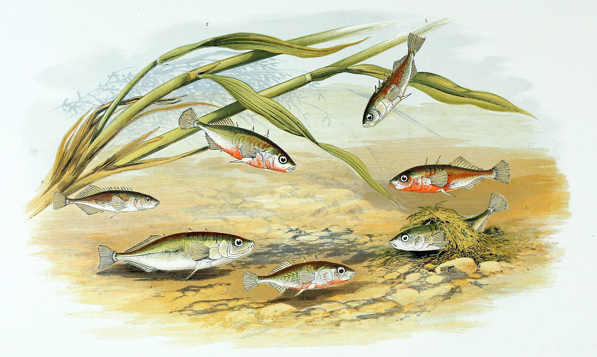
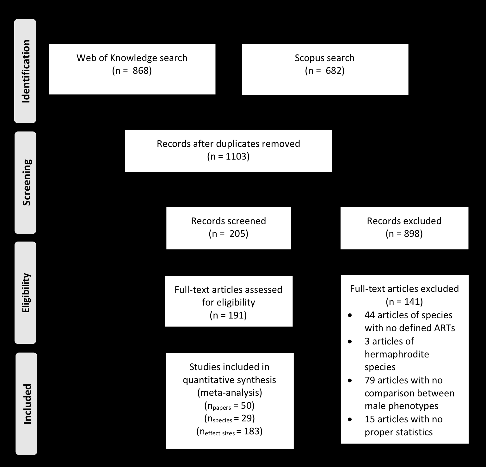
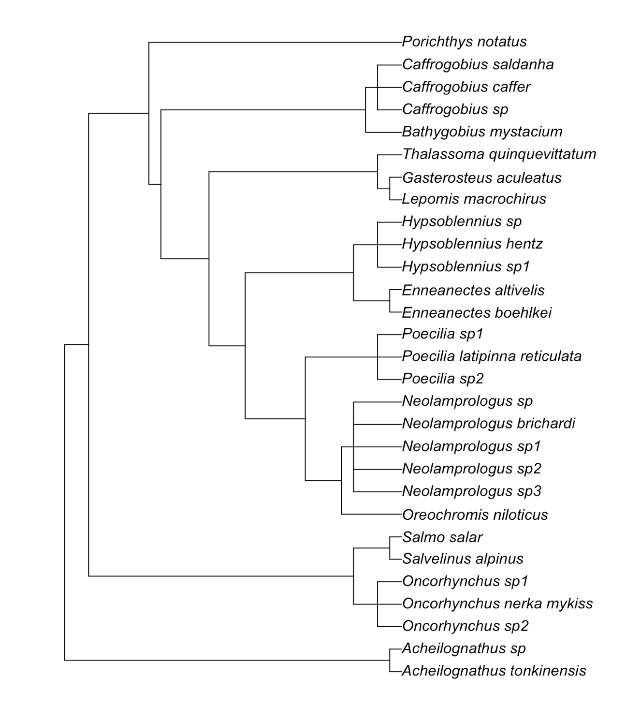

<!-- Converted from LygiaMattoDissertationFinal.pdf with a custom
     PyMuPDF + pdfplumber pipeline (see hifi.py). Headings, italics,
     escaped literals, table structure and figure placeholders preserved.
     Page comments give PHYSICAL page indices; printed folios run 2 behind. -->

<!-- physical page 1 (printed -) -->

Errata

Lygia Aguiar Del Matto

**Competição espermática entre majors e minors: uma meta-regressão em**

**peixes com táticas alternativas de acasalamento**

**Sperm competition games between majors and minors: a meta-regression**

**of fishes with alternative mating tactics**

*Gasterosteus aculeatus* por Alexander Francis Lydon / Archive.org (CC-PD-Mark)

São Paulo

2018

<!-- physical page 2 (printed -) -->

Lygia Aguiar Del Matto

**Sperm competition games between majors and minors: a meta-regression**

**of fishes with alternative mating tactics**

*Gasterosteus aculeatus* by Alexander Francis Lydon / Archive.org (CC-PD-Mark)

São Paulo

2018

<!-- physical page 3 (printed 1) -->

Lygia Aguiar Del Matto **Sperm competition games between majors and minors: a meta-regression**

**of fishes with alternative mating tactics**

**Versão original**

Dissertação apresentada ao Instituto de Biociências da

Universidade de São Paulo, para a obtenção do Título de

Mestre em Ciências, na área de Zoologia.

Orientador: Prof. Dr. Eduardo da Silva Alves dos Santos

São Paulo

Maio de 2018

<!-- physical page 4 (printed 2) -->

Ficha catalográfica elaborada pelo Serviço de Biblioteca do Instituto de Biociências da USP,

com os dados fornecidos pelo autor no formulário:

http://www.ib.usp.br/biblioteca/ficha-catalografica/ficha.php

Aguiar Del Matto, Lygia

Sperm competition games between majors and minors : a

meta-regression of fishes with alternative mating

tactics / Lygia Aguiar Del Matto ; orientador Eduardo da

Silva Alves dos Santos. -- São Paulo, 2018.

50 f. + anexo

Dissertação (Mestrado) - Instituto de Biociências da

Universidade de São Paulo, Departamento de Zoologia.

1. Competição espermática. 2. Meta-análise. 3. Seleção

sexual. I. da Silva Alves dos Santos, Eduardo, orient.

II. Título. Bibliotecária responsável pela estrutura da catalogação da publicação:

Elisabete da Cruz Neves – CRB – 8/6228

<!-- physical page 5 (printed 3) -->

# Comissão Julgadora

\_\_\_\_\_\_\_\_\_\_\_\_\_\_\_\_\_\_\_\_\_\_\_\_\_\_\_\_\_\_

\_\_\_\_\_\_\_\_\_\_\_\_\_\_\_\_\_\_\_\_\_\_\_\_\_\_\_\_\_\_ Prof(a). Dr(a).

Prof(a). Dr(a).

\_\_\_\_\_\_\_\_\_\_\_\_\_\_\_\_\_\_\_\_\_\_\_\_\_\_\_\_\_\_\_\_

Prof. Dr. Eduardo da Silva Alves dos Santos

Orientador

<!-- physical page 6 (printed 4) -->

# Dedicatória

À minha família,

que sempre me deu liberdade para fazer perguntas

<!-- physical page 7 (printed 5) -->

# Agradecimentos

Agradeço primeiro aos meus pais, Elaine e Paschoal, e à minha irmã, Gabriela. Se eles não tivessem se preocupado tanto com a minha educação eu talvez não estivesse onde estou hoje. Agradeço a eles por me apoiarem sempre, em todas as decisões que tomei até hoje e por terem me dado muitos e muitos livros. Obrigada por acreditarem em mim, mesmo quando eu deixo de acreditar. Obrigada por todo o amor e por nunca terem exigido que eu fosse uma pessoa diferente de quem eu sou, apesar de nós discordarmos às vezes.

Agradeço especialmente ao Vinícius, por ter me dado tanta força ao longo do mestrado. Obrigada por todo o amor e por todo o apoio emocional que permitiram que eu continuasse seguindo em frente. Obrigada por deixar minha vida mais leve.

Agradeço ao Edu, por ter topado me orientar na iniciação científica e depois no mestrado. Agradeço por ter acreditado na minha capacidade e por ter me dado bastante motivação para escrever esta dissertação. Também agradeço pela paciência para me explicar até as coisas mais simples e também por ter feito a análise de dados comigo.

Agradeço ao Bruno Buzatto por ter ajudado a desenvolver a ideia deste projeto e por ter contribuído nas etapas iniciais de coleta de dados.

Agradeço ao Gustavo Requena e ao Danilo Muniz por terem discutido um pouco deste projeto comigo e com o Edu durante um dos retiros científicos.

Agradeço aos meus colegas e amigos de laboratório, Pietro, Natcho e João, pelas conversas engraçadas e também pelas conversas sérias que contribuíram para a minha motivação e para a minha formação como pessoa. Agradeço principalmente ao Pietro e ao Natcho que acompanharam o início do meu mestrado e me auxiliaram com um projeto que infelizmente não deu certo. Obrigada pelas nossas divertidas rondas matinais para pintar as aranhas e obrigada por todo o auxílio em procurar ootecas e cuidar das *Nephilas* no laboratório.

Agradeço a todo o pessoal do laboratório G-Spot, Glauco, Louise, Soly, Rosa, Cris, Erika, Andrés, Billy, Vinícius Caldart, VP e Vinícius Montagner, por todas as reuniões que contribuíram enormemente para o meu aprendizado e senso crítico. Agradeço pelo ambiente instigante que vocês me proporcionaram durante todo o mestrado e IC. Agradeço também por estarem comigo e com o Pietro no congresso da Animal Behavior Society no Canadá. Foi meu primeiro congresso e o companheirismo de vocês nesse evento foi essencial para que eu me sentisse segura nesse ambiente novo e que faz parte da formação de todo cientista. Obrigada também por toda a experiência no retiro científico em Peruíbe junto com o pessoal do BECO. Vocês, o Edu e todo o pessoal do BECO me ensinaram o que é fazer ciência.

<!-- physical page 8 (printed 6) -->

Agradeço também à toda equipe do curso de ecologia da Mata Atlântica de 2016. Esse foi o curso que mais contribuiu para o meu aprendizado como cientista. Agradeço também a todos os amigos que fiz nesse curso, pelas risadas e conversas, lá no Taj Mahal ou em outros espaços por aqui.

Agradeço a todos os amigos que fiz na graduação e que me inspiram demais. Obrigada por tudo o que compartilhamos. Agradeço principalmente a Elisa e a Swing, por terem sido as primeiras amigas que fiz na graduação e por me apoiarem até hoje. Um agradecimento extra para a Elisa por todas as caronas até a USP.

Agradeço ao Conselho Nacional de Desenvolvimento Científico e Tecnológico (CNPq) e a Coordenação de Aperfeiçoamento de Pessoal de Nível Superior (CAPES) pela concessão da bolsa durante o meu mestrado.

<!-- physical page 9 (printed 7) -->

# Resumo em português

A teoria prevê que em espécies sob maior risco de competição espermática, os machos irão investir mais em características do ejaculado. Em espécies com táticas alternativas de acasalamento (AMTs), machos de fenótipos diferentes estão sob diferentes riscos de competição espermática. Uma vez que machos *minors* (i.e., machos furtivos) se esgueiram para dentro do território de outros machos para acasalar, eles provavelmente sempre enfrentam competição espermática. Machos *major*, por outro lado, defendem territórios e possuem uma chance maior de acasalar exclusivamente com fêmeas. Para os *majors*, o risco de competição espermática é teoricamente menor. A principal previsão de modelos de teoria dos jogos para espécies com AMTs é que *majors* investem menos em características de ejaculado do que *minors*. Entretanto, quando a proporção de *minors* em uma população aumenta, os *majors* devem investir mais em características do ejaculado, alcançando um nível similar de investimento em ejaculado que os *minors*. Neste estudo, nós testamos essas previsões com uma meta-regressão de 29 espécies de peixes com AMTs. Como *proxy* para o risco de competição espermática, nós classificamos cada espécie de acordo com um *ranking* de competição espermática. Esse *ranking* utiliza características de história de vida e demografia de cada espécie, e possui cinco níveis, de 1 (baixo risco de competição espermática) até 5 (alto risco de competição espermática). De maneira geral, nós encontramos que *minors* investem mais em características de ejaculado do que *majors*. Nós também categorizamos o investimento em ejaculado dos machos de acordo com as variáveis originais quantificadas nos estudos que foram incluídos na nossa análise e encontramos o resultado de que *minors* investem mais na produção de gônadas para seu próprio tamanho do que *majors*. Além disso, *minors* e *majors* apresentam investimento similar em número de espermatozoides e qualidade espermática, mas *majors* alocam mais esperma para as fêmeas. Em geral, o *ranking* de competição espermática não influenciou a magnitude da diferença de investimento entre *majors* e *minors*. O investimento diferencial em massa gonadal entre *majors* e *minors* deveria representar um aumento no número de espermatozoides, porém nossos dados mostraram que *majors* e *minors* não estão produzindo quantidades diferentes de esperma. Assim, um investimento maior em massa gonadal pode estar relacionado aos *minors* acasalarem mais frequentemente que os *majors.* *Minors* não conseguem produzir esperma em maiores quantidades que os *majors*, mas eles provavelmente conseguem repor seu estoque de esperma mais rápido que os *majors*. Contrário às previsões teóricas, a qualidade espermática não responde às variações de competição espermática, provavelmente porque a qualidade espermática não está sob forte seleção como a

<!-- physical page 10 (printed 8) -->

massa gonadal. Nossos resultados sugerem que, em peixes com táticas alternativas de acasalamento, tanto os *majors* como os *minors* estão sob forte seleção da competição espermática, mesmo quando o risco de poliandria é baixo. Palavras-chave: táticas alternativas de reprodução. competição espermática. machos furtivos e guardiões. GSI. qualidade espermática.

<!-- physical page 11 (printed 9) -->

# Abstract

Theory predicts that in species with a greater risk of sperm competition, males will invest more in ejaculate traits. In species with alternative mating tactics (AMTs), males of different phenotypes will be under different sperm competition risk. Because minors sneak inside other males' territories to mate they should always face sperm competition. Major males, on the other hand, defend territories and have more chance of mating exclusively with females. For majors, the risk of sperm competition is theoretically lower. The main prediction from game theory models for species with AMTs is that majors invest less in ejaculate traits than minors. However, when the proportion of minors in the population increases, majors should invest more in ejaculate traits, reaching a similar level of ejaculate expenditure to minors. In this study, we tested these predictions with a meta-regression analysis of 29 fish species with AMTs. As a proxy for the risk of sperm competition, we ranked each species according to a sperm competition rank with five levels, from 1 (low risk of sperm competition) to 5 (high risk of sperm competition). Overall, we found that minors invest more in ejaculate traits than majors. We also categorized the ejaculate expenditure of males, according to the original variables quantified in the studies that were included in our analysis and found that minors invest more energy in the production of gonads than majors. Additionally, minors and majors have a similar investment in sperm number and sperm quality, but majors allocate more sperm to females. Overall, the sperm competition rank did not influence the magnitude of the difference in investment of majors and minors. The differential investment in gonad mass between majors and minors should represent an increase in sperm numbers, but our data showed that majors and minors are not producing different amount of sperm. Therefore, the higher investment in gonad mass can be related to minors mating more frequently than majors. Minors are not able to produce sperm in greater quantities than majors, but they probably can replenish sperm faster than majors. Against theoretical predictions, sperm quality does not respond to differences of sperm competition, probably because sperm quality is not under such strong selection as gonad mass. Our findings suggest that, in fishes with alternative mating tactics, both majors and minors are under strong selection from sperm competition, even when the risk of polyandry is low. Keywords: alternative reproductive tactics. sperm competition. sneaks and guards. GSI. sperm quality.

<!-- physical page 12 (printed 10) -->

# Summary

Introduction ........................................................................................................................ 11 Methods .............................................................................................................................. 14 Literature search .............................................................................................................. 14 Data extraction ................................................................................................................ 15 Effect size calculation ..................................................................................................... 18 Data analysis ................................................................................................................... 19 Sensitivity analysis .......................................................................................................... 20 Results ................................................................................................................................ 20 Discussion........................................................................................................................... 24 References .......................................................................................................................... 27 Supplementary Material ...................................................................................................... 36

<!-- physical page 13 (printed 11) -->

# Introduction

Males face several challenges in order find available mates and, consequently, sire offspring. For instance, males may have to spend considerable energy, and face large costs during the pre-copulatory phase of the competition for mates. Mate searching, and competing with same sex individuals for mates, for example, are among the challenges that demand energy and represent large costs for males (Andrade, 2003; Schärf *et al*., 2013). Even if a male is successful in acquiring a mate, there is no guarantee that he will sire all offspring of a given mate. Most of the challenges faced by males during the pre-copulatory phase of the competition to gain reproductive success (i.e., pre-copulatory sexual selection) have to be faced again by their own sperm after copula, particularly when their mates copulated with multiple males. Firstly, spermatozoa have to move towards females eggs in many species, a behavior that is energetic demanding (Perchec *et al*., 1995). Secondly, when females copulate with multiple males, sperm from these males may compete to fertilize each one of the female’s eggs, a process known as sperm competition (Parker 1970, 1998).

Sperm competition is one of the processes that shape the mating behaviors across and within species. Over the years, models that use a game theory approach have been developed to predict how males will respond in ejaculate expenditure given different sperm competition scenarios (Parker, 1990a, 1990b; Parker, 1998; Parker *et al*. 2012). Sperm competition game models assume that the production of sperm is costly (Dewsbury, 1982; Wedell *et al*. 2002) and that males trade-off resource allocation between investing in ejaculate and in acquiring matings (Parker, 1998; Kvarnemo and Simmons, 2013). Another assumption of game theory models is that a higher expenditure in ejaculates increases male fertilization success (Parker, 1998; Martin *et al*., 1974). One of the predictions from game theory models is that, across species, males will invest more in ejaculates when the degree of sperm competition is higher (Parker, 1998). There is evidence in favor of this prediction in several taxa (Stockley *et al*., 1997; Byrne *et al*. 2002; Pitcher *et al*., 2005; Ramm *et al*., 2005). For example, in fishes, males of species with high communal spawning (e.g., *Meridia beryllina*: Middaugh and Hemmer, 1992) present greater values of the gonadosomatic index (i.e., GSI, often calculated as gonad mass divided by body or soma mass) and ejaculates with greater sperm numbers than males of species that generally mate in pairs rather than in groups (Stockley *et al*., 1997).

In game theory models, "ejaculate expenditure" is the response to sperm competition with other interacting components related to the life-history and the context of species or individuals (Parker, 1990a, 1990b, 1998; Parker *et al.*, 2012). Across the literature, "ejaculate

<!-- physical page 14 (printed 12) -->

expenditure" is interpreted as different traits related to sperm and that can be under the pressure of sperm competition. As for the example cited above (Stockley *et al*., 1997), gonad size and sperm numbers can represent "ejaculate expenditure". By allocating energy to gonad mass and sperm numbers, males can increase their likelihood of fertilizing more ova than other males. In fact, ejaculates with more sperm are linked to a higher fertilization success and to higher proportion of paternity of offspring in a clutch of eggs (Casselman *et al*., 2006). Besides allocating energy to traits that increase the quantity of sperm in ejaculates, males can also invest in sperm quality to increase their chances of fertilizing more ova than other males. Sperm quality represents different traits that make sperm more fertile (Snook, 2005; Fitzpatrick & Lüpold, 2014). For example, males can produce more efficient sperm by increasing sperm metabolic performance (Perchec *et al*., 1995), sperm motility (Gage *et al*., 2004; Casselman *et* *al*., 2006; Rudolfsen *et al*., 2008), sperm longevity (García-González and Simmons, 2005; Smith, 2012) or by making the swimming environment more favorable (Lahnsteiner *et al.*, 1997). However, studies that investigated whether sperm quality traits consistently respond to sperm competition across different species had conflicting results (Snook, 2005). Within species, individuals can also respond to the immediate levels of sperm competition by allocating more or less sperm to females based on social contexts (Wedell and Cook, 1999; Pizzari *et al.*, 2003). Sperm allocation is also a type of ejaculate expenditure that is expected to increase with an increased risk of sperm competition (Wedell *et al*. 2002).

In species with alternative mating tactics, males face different risk of sperm competition because of their phenotypes (Parker, 1990b; Taborsky, 1998). Species with alternative mating tactics (AMTs) are characterized by two or more male showing different phenotypes that use different sets of behaviors in order to gain matings (Taborsky, 1994; Gross, 1996; Taborsky *et* *al*., 2008; Taborsky and Brockmann, 2010). Importantly, these alternative tactics may lead to similar reproductive success (Gross, 1996). In general, species with alternative mating tactics present two distinct male phenotypes. Males that usually defend territories or females are classified as majors (Taborsky *et al*., 2008). Majors sometimes perform courtship behaviors that makes them more attractive to females (Rios-Cardenas *et al*., 2007). Males that usually do not defend territories or females are *classified* as minors (Taborsky *et al*., 2008). Minor males are less exuberant than majors to females and use sneak copulations inside a major’s territory to try to gain reproductive success.

Minors always face sperm competition, because they always mate with females in other males' territories (Parker, 1990b; Taborsky, 1998). Majors, however, face less sperm competition, as they defend their territories and prevent females from mating with other males.

<!-- physical page 15 (printed 13) -->

Because minors face more sperm competition, they are expected to invest more in traits that can make them greater sperm competitors than majors. A game theory model of sperm competition in species with alternative mating tactics predicts this pattern (Parker, 1990b). Moreover, if the proportion of minors increases in a population, the model predicts that majors will also increase their investment in traits related to sperm competition (Parker, 1990b). The increase in the proportion of minors represents an increase in the level of sperm competition for majors, because the chances of a major mating with a female that will mate with another male will increase. As a result, majors will have an investment in ejaculate expenditure that approaches the investment made by minors, because the pressure of sperm competition will be similar to all individuals. When the proportion of minors is too low, it is predicted that sperm competition is not strong enough for majors and minors to make great investments in ejaculate expenditure (Parker, 1990b). Therefore, majors and minors should have similar ejaculate expenditure when sperm competition is too low and when it is too high. In intermediate sperm competition levels, the difference of ejaculate expenditure between majors and minors will be the greatest (Parker, 1990b). A comparative analysis of dimorphic dung beetles of the genus *Onthophagus* supports the prediction that minors will invest more in traits related to sperm competition, because minors of the species of *Onthophagus* had proportionally larger testis than majors (Simmons *et al*., 2007). However, the prediction that majors and minors will invest similarly in sperm competition when the proportion of minors increases was not supported in that study (Simmons *et al*., 2007).

Several fish species present alternative male mating tactics. In most fish species, fertilization occurs externally (Montgomerie & Fitzpatrick, 2009) and grouping spawning is also common. These characteristics not only favor the occurrence of alternative mating tactics, but also favor the occurrence of sperm competition (Taborsky, 2008). Thus, fish are an ideal group to investigate theoretical predictions of game theory models of how alternative male phenotypes should invest into traits to deal with differing levels of sperm competition. As far as we are aware, no study has investigated these predictions using an analysis across species with alternative male phenotypes.

In this study, we use a phylogenetic meta-regression analysis, using different fish species with male alternative mating tactics, to test the prediction proposed by Parker (1990a) that majors and minors will have different investment in sperm competition traits according to their phenotype and the level of sperm competition. The theoretical model by Parker predicts that minors will make greater investments in ejaculate expenditure than majors. Moreover, we will test the prediction that the difference between the investment of majors and minors will be

<!-- physical page 16 (printed 14) -->

greater when species have an intermediate level of sperm competition than when levels of sperm competition are low and high.

# Methods

## Literature search

We conducted a systematic literature search using the platforms *Web of Knowledge* and *Scopus*. Our search was last updated on the 16th of May of 2017. We used the following combination of keywords at the basic search in all databases of the *Web of Knowledge* platform and at the advanced search of the *Scopus* platform: ("alternat\* sex\* behavio\*r\*" OR "alternat\* sex\* role\*" OR "alternat\* sex\* phenotype\*" OR "alternat\* sex\* tactic\*" OR "alternat\* sex\* strateg\*" OR "alternat\* reproductive behavio\*r\*" OR "alternat\* reproductive role\*" OR “alternat\* reproductive phenotype\*” OR "alternat\* reproductive tactic\*" OR "alternat\* reproductive strateg\*" OR "alternat\* mating behavio\*r\*" OR "alternat\* mating role\*" OR "alternat\* mating phenotype\*" OR "alternat\* mating tactic\*" OR "alternat\* mating strateg\*" OR "reproductive role\*" OR "reproductive phenotype\*" OR "reproductive tactic\*" OR "reproductive strateg\*" OR "mating role\*" OR "mating phenotype\*" OR "mating tactic\*" OR "mating strateg\*" OR "male\* \*morph\*") AND ("sperm competition" OR "testis size" OR "ejaculate" OR "sperm allocation" OR "post\*copulato\*"). The search in *Web of Knowledge* returned 868 results and the search in *Scopus* returned 682 results. After removing duplicates from both searches, we obtained 1,103 distinct results in total (Fig. 1).

<!-- physical page 17 (printed 15) -->

**Fig 1.** The screening process of exclusion and inclusion of articles following data extraction criteria, illustrated by a PRISMA flow diagram (Moher *et al*. 2009).

## Data extraction

We read all the titles and abstracts from the results obtained in our searches in order to include articles that met the following criteria: (a) studied one or more fish species/populations, (b) had some indication that the males of the species have at least two distinct mating tactics (by mentioning different morphs or different specific behaviors), (c) abstract of the study presented some indication that both male phenotypes, if present, were compared in relation to characteristics involved in sperm competition and/or body size. After using these criteria, a total of 205 articles remained in our dataset (Fig. 1).

For the current version of this manuscript, we read 191 articles (of the 205 in our dataset; 14 articles were not screened because of time constraints) and applied the following, more detailed inclusion criteria: (a) confirmation that the study was about fish species, (b) species were not hermaphrodite, (c) confirmation that males have at least two described mating

<!-- physical page 18 (printed 16) -->

tactics, (d) male phenotypes were compared in relation to characteristics involved in sperm competition (regardless of comparisons between body size), and (e) the presence of proper statistics. Proper statistics in this case means the study reports the mean estimate of the response variable, sample size, and S.D. or S.E. for descriptive analysis. In some cases, the relevant data was reported in figures and, in these cases, we extracted data using *GraphCIick* (version 3.0.3; Arizona Software, 2012) or the *metaDigitise* package for R (Pick *et al.*, 2018; version 3.4.0, R Core Team, 2017). If no descriptive statistics were reported, we extracted data from inferential analyses (i.e., *t*-values, or *F*-values for one-way ANOVA, Wilcoxon matched pair signed-rank, Mann-Whitney U-test) only when authors reported the direction of the effect (i.e., which male phenotype presented the larger trait). Only if the study met all the criteria mentioned above it was included in our analyses (see Fig. 1). After reading the full text of 192 articles, we kept 50 studies in our dataset.

To understand how quality, quantity and allocation of sperm differ in relationship to alternative mating tactics and sperm competition, we categorized the response variables extracted from the original articles into three sperm expenditure categories. The first category is "Production" and we included in this category variables that represent investment in sperm number or sperm volume. This category was subdivided into "Quantity" and "GSI" subcategories. We classified as "Production/Quantity" variables such as sperm density, sperm count and sperm volume (Table 1). The only variable classified as "Production/GSI" was the Gonadal Somatic Index (GSI; either total body mass based, soma mass based and in one case energy based). We subdivided the "Production" category because the GSI represents investment in relation to individual body sizes, and other sperm traits represent the outcome of this investment in sperm numbers. For this version of the manuscript, we excluded all variables of gonad mass because they are not independent from GSI. The second category is "Quality" and we included in this category variables that represent investment in sperm quality. We included variables such as sperm velocity (average, straight and curvilinear velocities), sperm length (including midpiece, head and tail lengths), ATP concentration, motility, longevity, enzyme activity and seminal vesicle somatic index (SVSI) in the "Quality" category. All response variables used are in Table 1. When authors measured motility and velocity at multiple times post sperm activation, we extracted data only for the first measurement after activation. The third category is "Allocation" and we included in this category variables that comprehend facultative investment of males as an immediate response to sperm competition; i.e., variables that could be strategically modulated by males upon ejaculation. We included

<!-- physical page 19 (printed 17) -->

variables such as sperm concentration in the water and number of ejaculations per spawning in the "Allocation" category.

The best proxy for the intensity of sperm competition faced by males in natural settings is, perhaps, the proportion of minor males in the population, when data was collected. Nevertheless, most of the studies in the dataset did not report the proportion of minors at their data collection sites. Thus, in order to make use of most of the data, we had to use a different proxy for the intensity of sperm competition. Therefore, we searched the literature of sperm competition in fishes and decided to choose a well-known index of the intensity of sperm competition. We classified each species in our dataset using life-history data from the literature to estimate the sperm competition rank proposed by Stockley *et al*. (2007). Similar ranks have been used in well-conducted comparative analyses (Byrne *et al*., 2002; Fitzpatrick *et al*., 2009). The sperm competition rank, as proposed by Stockley *et al*. (2007), ranges from 0 to 5 (in discrete categories). Species classified as level 0 have internal fertilization, including fertilization that occurs inside the mouth, and no polygamy or spawning in groups. Level 1 is composed of species that have internal fertilization with low group spawning or polygamy or external fertilization with pairing and no group spawning. On level 2, species have internal fertilization with high degree of spawning in groups or polygamy, or species have external fertilization with pairing and low incidence of spawning in groups. On level 3, all species have external fertilization with pairing and moderate spawning in groups, or species have no pairing and low spawning in groups. On level 4, all species have external fertilization, make pairings and there is a high incidence of spawning in groups, or species make no pairings and spawning in groups is low. On level 5, species have no pairing and spawning in groups has a high level. Therefore, level 5 corresponds to the species with higher levels of sperm competition in comparison to other levels in the rank, with level 0 the one with the least sperm competition.

**Table 1.** List of all response variables we collected to calculate Hedges' g separated in the three categories created for sperm expenditure

| Category | Response variables |
| --- | --- |
| Production | sperm count |
| Production | Gonadal Somatic Index (GSI) |
| Production | sperm density |
| Production | relative testicular gland area |
| Production | sperm volume |
| Production | milt mass |
| Production | % glandular tissue |

<!-- physical page 20 (printed 18) -->

## Effect size calculation

All the original studies in our dataset compared two groups of males in relation to different sperm expenditure traits. As we were interested in quantifying the magnitude of the difference between the investment of minor and major males, we chose a standardized effect size metric to represent this difference. To calculate the effect size of these differences we used Hedges' g. Hedges' g represents the standardized difference between the means of two groups and also corrects for small sample sizes (Hedges, 1981). For most of the papers we extracted data, we calculate Hedges' g using the means of major and minor groups and the corresponding standard deviation. If S.D. was not reported, we calculated S.D. based on the S.E. or the 95% confidence interval. When authors did not report any descriptive statistics or did not present data in plots,

| Category | Response variables |
| --- | --- |
|  | stripped sperm mass |
| Quality | sperm velocity (total or of the 10% fastest sperm) |
| Quality | average path velocity of sperm |
| Quality | straight line velocity of sperm |
| Quality | curvilinear sperm velocity of sperm |
| Quality | loss of path velocity |
| Quality | linearity |
| Quality | % or proportion of motile sperm |
| Quality | duration of motility |
| Quality | sperm total length |
| Quality | sperm flagellum length |
| Quality | sperm end piece length |
| Quality | sperm midpiece length |
| Quality | sperm head length |
| Quality | sperm head width |
| Quality | ATP concentration |
| Quality | Pyruvate kinase activity in sperm |
| Quality | Citrate synthase activity in sperm |
| Quality | longevity of sperm |
| Quality | seminal vesicle mass |
| Quality | Seminal Vesicle Somatic Index (SVSI) |
| Quality | Testicular Gland Index (TGI) |
| Quality | testicular gland area |
| Quality | accessory gland mass |
| Quality | accessory gland corrected for body mass |
| Quality | energy charge values (based on ATP and ADP) |
| Allocation | number of ejaculations per spawning |
| Allocation | sperm concentration (sperm per mL of water) |
| Allocation | sperm per spawn |
| Allocation | proportion of sperm delivered in relation to sperm at rest |

<!-- physical page 21 (printed 19) -->

we calculated effect size based on inferential statistics. We used the Practical Meta-Analysis Effect Size Calculator (Wilson, 2018) to calculate effect size based on inferential statistics.

We adjusted the directionality of our effect sizes so that positive effect sizes represent a greater mean value for majors when compared to minors. Negative effect sizes represent a greater mean value for minors when compared to majors. We corrected the direction of Hedges' g based on the criteria above when effect size was calculated from inferential statistics. We used the Hedges' g values of 0.2, 0.5 and 0.8 as benchmarks for small, medium and large effects (Cohen, 1969). In total, we estimated 183 effects sizes from 50 studies, with 29 fish species (Supplementary Table 1). Of all the effect sizes we calculated, 65 were calculated from variables associated to sperm production (35.5%), 31 for GSI and 34 for Quantity, 107 effect sizes to sperm quality (58.5%) and 11 effect sizes to sperm allocation (6%). Thus, given the small sample of sperm allocation effect sizes, we only included these data in a model to estimate the mean meta-analytic effect of each type of sperm expenditure variable.

## Data analysis

First, we tested the prediction that minors invest more than majors in traits to deal with sperm competition. To test this prediction, we built a meta-regression model that included the type of investment variable as a categorical predictor. We chose to parameterize this model so that we obtained the mean meta-analytic estimate for each level of the investment variable categorical variable. This allowed us to test whether each level of this predictor variable differed from zero (0). The predictor, investment variable category was fit with four levels (allocation, production as sperm quantity, production as GSI, and quality). This model included three random effects to account for the hierarchical nature of the dataset. We fit paper identity, species identity and also a phylogeny term (Fig. S1).

Second, to test whether the level of investment made by minors and majors was influenced by the intensity of sperm competition, we fit an additional meta-regression model. In this second model, we used a subset of the data that consisted of effect sizes estimated for three levels of the investment variable category (production in quantity, production in GSI, and quality). We removed the allocation effect sizes as they had a small sample size. Moreover, as most of the effect sizes after this subset was created came from observational studies conducted in natural settings, we removed the small number of effect sizes from experimental/laboratory studies.

<!-- physical page 22 (printed 20) -->

This second model included an interaction between the predictors: type of investment variable category and level of sperm competition. Level of sperm competition was fit as a categorical variable with five levels. As we were only interested in making inferences within each level of investment variable category, we parameterized the model so that the interactions were restricted to each level of this variable.

Based on our hypothesis, our predictions are: (1) there is a significant difference in investment in traits related to sperm competition between minor and major males, for all subtypes of investment (quantity, GSI, quality and allocation), with minors investing more than majors and (2) the difference in investment in traits related to sperm competition between minors and majors is higher in species classified as having an intermediate sperm competition rank and the difference in investment in traits related to sperm competition between majors and minors is smaller in species with a higher and lower sperm competition ranks, for all subtypes of sperm investment.

We estimated the effect size of the difference in sperm investment between majors and minors using a phylogenetic meta-analytic model using the function *rma.mv* in the package *metafor* (Viechtbauer, 2010) in R (version 3.4.0, R Core Team, 2017). Effect sizes were deemed to be statistically significant when 95% confidence intervals (CI) did not overlap zero.

## Sensitivity analysis

As a form of sensitivity analysis, we used Egger's regressions (Egger *et al.*, 1997) to investigate if publication bias was present in our datasets. We also quantified the amount of heterogeneity explained by our models and by the random effects of each model. To quantify heterogeneity, we used a modified version of the *I**2* metric (see Nakagawa and Santos 2012). For the phylogeny random effect, *I**2* can be interpreted as analogous to phylogenetic signal (see Housworth *et al.*, 2004).

# Results

We found that minors invested more than majors in all forms of sperm expenditure, as the overall meta-analytic mean effect was negative and moderate (-0.519, 95% CI: -1.317 to 0.278), but note that the 95% CI overlapped zero. This overall meta-analytic model presented high heterogeneity (83.21%; Table 2), as expected in biological meta-analyses.

<!-- physical page 23 (printed 21) -->

**Table 2.** Summary of total heterogeneity value and random effects heterogeneity values of models used in this meta-analysis.

| Model | Moderators | Random effects | I²study identity % (95% CI) | I²species identity % (95% CI) | I²phylogeny % (95% CI) | I²total % (95% CI) |
| --- | --- | --- | --- | --- | --- | --- |
| Null Model | NA | study identity + species + phylogeny | 55.46 (53.54 to 57.38) | 9.35 (7.43 to 11.28) | 18.38 (16.46 to 20.30) | 83.21 (81.60 to 85.44) |
| Meta-regression model 1 | variable type | study identity + species | 76.02 (74.10 to 77.94) | 7.50 (5.58 to 9.42) | NA | 83.52 (81.60 to 85.44) |
| Meta-regression model 2 | variable type : sperm competition rank | study identity + species | 46.24 (44.32 to 48.16) | 36.33 (34.41 to 38.25) | NA | 82.57 (80.65 to 84.50) |

In our first meta-regression analysis, we tested whether the type of expenditure investment variable influenced the magnitude of the effect size. We found that majors invested significantly more in allocation traits than minors, and that the effect size was large (2.732, 95% CI: 1.476 to 3.989; Fig. 2). Minors, on the other hand, invested significantly more in gonad mass in relation to their own body size (*i.e.*, GSI) than majors (-2.638, 95% CI: -3.105 to -2.177; Fig. 2). However, we found small and non-significant effect sizes for sperm expenditure traits related to sperm quality (-0.251, 95% CI: -0.699 to 0.197; Fig. 2) and absolute sperm quantity (-0.384, 95% CI: -0.845 to 0.076; Fig. 2). We found high heterogeneity in this meta-regression model (83.52%; Table 2). A large proportion of the heterogeneity was explained by the study identity (76.02%; Table 2) and the species identity (9.35%; Table 2) random effects. Phylogeny explained virtually no variation and was removed from the model.

<!-- physical page 24 (printed 22) -->

> **[Figure 2 — vector plot, not extractable as text]** Horizontal forest plot. y-axis categories (top to bottom): Quality, Production (Quantity), Production (GSI), Allocation. x-axis: Hedge's g, ticks at -2, 0, 2, 4; vertical dashed line at 0.

**Figure 2.** Standardized mean Hedge's g effect sizes ± 95% CIs of the differences between majors and minors in investment in traits related to sperm competition by the type of sperm investment. Vertical dashed line represents Hedge's g equal to zero.

Finally, we built a meta-regression model using only the effect sizes obtained from observational studies and excluding sperm allocation traits (due to small sample sizes, see Methods, above). In this model, we included, in addition to the type of sperm investment variable, the level of sperm competition as a predictor. Within each type of investment variable, we found little evidence that the level of sperm competition influenced the difference in investment between minors and majors (Table 3; Fig. 3). That is, the magnitude of the difference in investment between minors and majors was similar across the range of sperm competition ranks. This meta-regression model also presents high heterogeneity (82.57%;

<!-- physical page 25 (printed 23) -->

> **[Figure 3 — vector plot, not extractable as text]** Grouped forest plot. x-axis: Variable Type (Production (Quantity), Production (GSI), Quality). y-axis: Hedge's g, ticks to -4. Colour legend: Sperm Competition Rank 1-5; horizontal dashed line at 0.

Table 2). For this meta-regression model, a large proportion of the heterogeneity was also explained by the study identity (46.24%; Table 2) and the species identity random effects (36.33%; Table 2). Phylogeny was also removed from this model because it did not explain variation.

**Figure 3.** Standardized mean Hedge's g effect sizes ± 95% CIs of the differences between majors and minors in investment in traits related to sperm competition by the type of sperm investment under different sperm competition ranks. Dashed horizontal line represents Hedge's g equal to zero. See methods for more details.

<!-- physical page 26 (printed 24) -->

We found little evidence of publication bias in our models, as indicated by the intercept terms of the Egger's regressions not being statistically different from zero (Table 3).

**Table 3.** Results of the Egger's regressions for the models used in this study.

| Model | Moderators | Random effects | Intercept | *t*-value | *p*-value |
| --- | --- | --- | --- | --- | --- |
| Null Model | NA | study identity + species + phylogeny | -0.323 | -0.633 | 0.528 |
| Meta-regression model 1 | variable type | study identity + species | -0.338 | -0.664 | 0.507 |
| Meta-regression model 2 | variable type : sperm competition rank | study identity + species | -0.610 | -1.067 | 0.288 |

# Discussion

In this study, we investigated the hypothesis that, in fishes with male alternative mating tactics, minor males invest more in sperm traits related to sperm competition than major males. Overall, we found that minors invest more in sperm traits than majors, yet this overall result was not statistically significant. We then tested whether different categories of sperm traits modulated how majors and minors invest into dealing with sperm competition. Interestingly, we found that minors invest significantly more in relative gonad size than majors and, contrary to our general prediction, majors allocate significantly more sperm than minors during ejaculation bouts. We found that minors invested more than majors in “quantity” and “quality” traits, but the effect sizes were small, and the confidence intervals overlapped zero. We also tested the prediction that the level (intensity) of sperm competition would influence the investment in traits related to sperm competition; that is, the differences in sperm expenditure between majors and minors would be higher on intermediate levels and decrease as sperm competition became stronger. We found that the level of sperm competition had very little influence on the magnitude of the difference between majors and minors. Below, we discuss the findings of our

<!-- physical page 27 (printed 25) -->

meta-analysis with regards to theoretical implications for the understanding of sperm competition.

Selection through sperm competition should favor larger testes because this can directly increase sperm quantity and, therefore, the likelihood of fertilization. Several studies that investigated the relationship between testes size and sperm competition in species with alternative tactics have found conflicting patterns (see, for example, Smith & Ryan, 2010; Simmons *et al*., 1999; Byrne, 2004; Kelly, 2008). Our study provides robust overall evidence that in fishes with male alternative tactics, minors make greater investment in relative gonad size. Interestingly, our meta-analytic approach allowed us to gain a more refined understanding of how sperm competition influences the investment in sperm production by the alternative male phenotypes. While minors make large investments into relative gonad size, we found the sperm quantity *per se* is similar between majors and minors. Combined, these two findings provide some important insights. First, finding evidence that majors and minors exhibit similar amount of sperm in their testes suggests that both tactics are experiencing similar levels of sperm competition risk per spawning event. Both tactics, according to these findings, have similar amount of sperm available at their disposal for a spawning event. Second, the larger investment into relative testes size by minors indicate that these males are able to replenish their sperm stocks faster than majors. This is likely a consequence of the different behavioral phenotypes exhibited by these tactics in order to obtain fertilizations. While majors possess similar number of sperm cells available, the probably copulate in lower frequencies than minors. Minors, probably need to replenish their sperm stocks much faster in order to try and sneak copulations with different females. Thus, it seems that sperm competition in fishes with male alternative tactics acts similarly in these phenotypes on the investment into sperm quantity but given the different routes to achieve fertilizations by majors and minors, gonad size is possibly a result of a combination of factors other than just sperm competition.

The percentage of paternity males have over offspring is related to the number of sperm males allocate to females (Martin *et al.*, 1974; Simmons, 1987; Wedell, 1991; Wedell and Cook, 1998). But there is a share of the resulting paternity that is not explained by the number of sperm males allocate (Snook, 2005; Parker and Pizzari, 2010). There are two main non-exclusive factors that can explain the share of paternity not directly related to the number of sperm. One of the factors is that females have mechanisms to favor specific sperm or sperm of specific males (i.e. cryptic female choice; Birkhead, 1998). For example, in Chinook salmon, a species with external fertilization, males that are less related to females sire more offspring when fertilization occurs in the presence of ovarian fluid than when it occurs in water (Lehnert

<!-- physical page 28 (printed 26) -->

*et al.*, 2017). The other factor that explains unexpected shares of paternity is the variance in sperm quality between males. For example, in Atlantic salmon, sperm quality was positively correlated to fertilization success (Vladić and Järvi, 2001). Our data show that the investment in sperm quality is not different between majors and minors, regardless of sperm competition levels. Therefore, sperm competition does not seem to affect sperm quality as strongly as it affects other types of investment, such as gonad mass. How traits related to sperm quality respond to sperm competition is still a less understood question (Snook, 2005). As discussed by Smith and Ryan (2010), the evolution of sperm quality traits can be dissociated from the evolution of traits that enhance the number of sperm. There is a theoretical prediction that some sperm quality traits, such as sperm size and longevity, should respond more to the risk sperm competition when there are constraints to the evolution of sperm numbers (Parker, 1993).

Our results indicate that majors allocate more sperm per spawning event that minors, despite the lack of difference in the sperm production in their gonads (see above). This result is the opposite of what is predicted by game theory models and counterintuitive when considering that majors theoretically face less sperm competition, and that there a large number of studies that support the increase of sperm allocation when the risk of sperm competition is experimentally increased (Gage and Barnard, 1996; Pizzari *et al.*, 2003; for a meta-analysis see: Kelly and Jennions, 2011). As our sample size is small (n = 11) for allocation traits, more data on this type of investment is needed so that a robust conclusion can be inferred. Therefore, we encourage researchers to conduct more experiments manipulating the number of sneakers and comparing sperm allocation between majors and minors.

One prediction from Parker's theoretical model of sperm competition between minors and majors is that, across species, males will invest more into sperm traits as the likelihood of sneak mating (Parker 1990b), or the frequency of minors in the population (Gage *et al*., 1995) increases. Our meta-regression analysis with fishes with alternative male phenotypes showed that investment in sperm traits was not influenced by increases in the level of sperm competition (as measured by the sperm competition rank). Our finding is, thus, not consistent with Parker's (1990b) prediction. Similar to our results, species of *Onthophagus* beetles that have a higher proportion of minors did not have greater difference of testes size between mating tactics (Simmons *et al*., 2007). It is possible that our results and Simmons *et al.* (2007) results occur due to sperm competition faced by majors being greater than expected. This means that the probability of females mating with more than one male is higher than expected. The similar expenditure in sperm numbers between majors and minors (Fig. 2) is evidence of majors facing similar sperm competition than minors. Parker's (1990b) model predicts a curvilinear

<!-- physical page 29 (printed 27) -->

relationship between the increasing probability of sneak matings and expenditure in sperm traits. The model predicts that at moderate levels of sperm competition risk (in our case, a sperm competition rank of 3), the disparity between the investment of majors and minors should be at its maximum. Yet, even if we consider the tendency of the average effect size coefficients (not considering their 95% CIs) it seems that the sperm trait expenditure is behaving contrary to Parker's prediction. As Simmons *et al*. (2007) have stated, discrepancies between model predictions and empirical findings can be attributed to violations of the model's assumptions. In this sense it is worth noting, as Simmons *et al*. (2007) did, that Parker's (1990b) sneak-guard model assumes majors only face sperm competition from one minor male at a time. Most of the fish species included in our meta-analysis are external fertilizers. This natural history fact means that the sneak-guard model assumption is most likely violated in this case. Majors of these fish species will most likely have to deal with several minors trying to sneak matings with the female being courted. Therefore, it seems reasonable to expect that the risk of sperm competition, even at low levels (such as a sperm competition rank of 1), should be strong enough to cause the investment patterns we observe in this meta-analysis.

In conclusion, we have conducted the first meta-analysis testing Parker's (1990b) predictions about sperm competition in species with male alternative phenotypes. Using a sample of 29 fish species, we found that relative gonad size was larger in minors than in majors, supporting one of Parker's predictions. However, contrary to the theoretical predictions, we did not find support for the influence of the increase in sperm competition risk on the magnitude of the difference in investment by minors and majors. Taken together, our findings suggest that, in fishes with alternative mating tactics, both majors and minors are under strong selection from sperm competition, even when the risk of polyandry is low.

# References

\*Represents references from which effect sizes were estimated. Andrade, M. C. B. (2003) Risky mate search and male self-sacrifice in redback spiders.

*Behavioral Ecology*, 14, 531–538. Arizona

Software

Inc

(2012)

GraphClick

3.0.3.

URL:

http://www.arizona-

software.ch/graphclick/ Birkhead, T. R. (1998) Cryptic female choice: criteria for establishing female sperm choice,

*Evolution*, 52, 1212-?.

<!-- physical page 30 (printed 28) -->

\*Burness, G. Casselman, S. J., Schulte-Hostedde, A. I., Moyes, C. D., Montgomerie, R. (2004)

Sperm swimming speed and energetics vary with sperm competition risk in bluegill

(*Lepomis macrochirus*). *Behavioral Ecology and Sociobiology*, 56, 65–70. \*Burness, G., Moyes, C. D. and Montgomerie, R. (2005) Motility, ATP levels and metabolic

enzyme activity of sperm from bluegill (*Lepomis macrochirus*). *Comparative*

*Biochemistry and Physiology*, 140, 11–17. \*Butts, I. A. E., Love, O. P., Farwell, M., Pitcher, T. E. (2012) Primary and secondary sexual

characters in alternative reproductive tactics of Chinook salmon: associations with

androgens and the maturation-inducing steroid. *General and Comparative*

*Endocrinology*, 175, 449–456. Byrne, P. G., Roberts, J. D., Simmons, L. W. (2002) Sperm competition selects for increased

testes mass in Australian frogs. *Journal of Evolutionary Biology*, 15, 347–355. Byrne, P. G. (2004) Male sperm expenditure under sperm competition risk and intensity in

quacking frogs. *Behavioral Ecology*. 15, 857–863. Casselman, S. J., Schulte-Hostedde, A. I., Montgomerie, R. (2006) Sperm quality influences

male fertilization success in walleye (*Sander vitreus*). *Canadian Journal of Fisheries*

*and Aquatic Sciences*, 63, 2119–2125. Cohen, J. (1969) Statistical power analysis for the behavioral sciences. New York, The United

States of America: Academic Press. \*Côte, J., Blier, P. U., Caron, A., Dufresne, F. (2009) Do territorial male three-spined

sticklebacks have sperm with different characteristics than nonterritorial males?.

*Canadian Journal of Zoology*, 87, 1061–1068. Dewsbury, D. A. (1982) Ejaculate cost and male choice. *The American Naturalist*, 119, 601-

610. Egger M., Davey S. G., Schneider M., Minder C. (1997) Bias in meta-analysis detected by a

simple, graphical test. *BMJ*, 315, 629–634. \*Fagundes, T., Simões, M.G., Gonçalves, D., Oliveira, R.F. (2012) Social cues in the

expression of sequential alternative reproductive tactics in young males of the peacock

blenny, *Salaria pavo*. *Physiology & Behavior*, 107, 283–291. Fitzpatrick, J. L., Lüpold, S. (2014) Sexual selection and the evolution of sperm quality. *MHR:*

*Basic Science of Reproductive Medicine*, 20, 1180–1189. \*Fitzpatrick, J. L.*,* Desjardins, J.K., Milligan, N., Montgomerie, R., Balshine, S*.* (2007)

Reproductive-tactic-specific variation in sperm swimming speeds in a shell-brooding

cichlid. *Biology of Reproduction*, 77, 280–284.

<!-- physical page 31 (printed 29) -->

\*Fitzpatrick, J. L*.*, Earn, D. J., Bucking, C., Craig, P. M., Nadella, S., Wood, C. M., Balshine,

S. (2016) Postcopulatory consequences of female mate choice in a fish with alternative

reproductive tactics. *Behavioral Ecology*, 27, 312–320. Fitzpatrick, J. L., Montgomerie, R., Desjardins, J. K., Stiver, K. A., Kolm, N. and Balshine, S.,

(2009) Female promiscuity promotes the evolution of faster sperm in cichlid

fishes. *Proceedings of the National Academy of Sciences*, *106*, 1128-1132 \*Flannery, E. W. Butts, I. A., Słowińska, M., Ciereszko, A., Pitcher, T. E. (2013) Reproductive

investment patterns, sperm characteristics, and seminal plasma physiology in

alternative reproductive tactics of Chinook salmon (*Oncorhynchus tshawytscha*).

*Biological Journal of the Linnean Society*, 108, 99–108. Gage, A. R. and Barnard, C. J. (1996) Male crickets increase sperm number in relation to

competition and female size. *Behavioral Ecology and Sociobiology*, 38, 349–353. Gage, M. J. G.*,* Macfarlane, C. P., Yeates, S., Ward, R. G., Searle, B., Parker, G. A. (2004)

Spermatozoal traits and sperm competition in Atlantic salmon: relative sperm velocity

is the primary determinant of fertilization success. *Current Biology*, 14, 44–47. \*Gage, M. J. G., Stockley, P., Parker, G. A. (1995) Effects of alternative male mating strategies

on characteristics of sperm production in the Atlantic salmon (*Salmo solar*): theoretical

and empirical investigations. *Philosophical transactions of the Royal Society of*

*London. Series B, Biological sciences*, 350, 391–399. \*Gage, M. J. G., Stockley, P., Parker, G. A. (1998) Sperm morphometry in the Atlantic salmon.

*Journal of Fish Biology*, 53, 835–840. García-González, F. and Simmons, L. W. (2005) Sperm viability matters in insect sperm

competition. *Current Biology*, 15, 271–275. Gross, M. R. (1996) Alternative reproductive strategies and tactics: diversity within sexes.

*Trends in Ecology and Evolution*, 11, 92-98. \*Hellmann, J. K. Connor, C. M. O., Ligocki, I. Y., Farmer, T. M., Arnold, T. J., Reddon, A.

R., Garvy, K. A., Marsh-Rollo, S. E., Balshine, S., Hamilton, I. M. (2015) Evidence for

alternative male morphs in a Tanganyikan cichlid fish. *Journal of Zoology*, 296, 116–

123. Housworth, E. A., Martins, E. P., Lynch, M. (2004) The phylogenetic mixed model. *The*

*American Naturalist*. 163, 84–96. \*Hoysak, D. J. and Liley, N. R. (2001) Fertilization dynamics in sockeye salmon and a

comparison of sperm from alternative male phenotypes. *Journal of Fish Biology*, 58,

1286–1300.

<!-- physical page 32 (printed 30) -->

\*Hurtado-Gonzales, J. L. and Uy, J. A. C. (2009) Alternative mating strategies may favour the

persistence of a genetically based colour polymorphism in a pentamorphic fish. *Animal*

*Behaviour*, 77, 1187–1194. \*Katoh, R., Munehara, H., Kohda, M. (2005) Alternative male mating tactics of the substrate

brooding cichlid *Telmatochromis temporalis* in Lake Tanganyika. *Zoological Science*,

22, 555–561. Kelly, C. D. 2008. Sperm investment in relation to weapon size in a male trimorphic insect?

*Behavioral Ecology*. 19, 1018–1024. Kelly, C. D. and Jennions, M. D. (2011) Sexual selection and sperm quantity: meta-analyses

of strategic ejaculation. *Biological Reviews*, 86, 863–884. \*Koseki, Y. and Maekawa, K. (2002) Differential energy allocation of alternative male tactics

in masu salmon (*Oncorhynchus masou*). *Canadian Journal of Fisheries and Aquatic*

*Sciences*, 59, 1717–1723. Kvarnemo, C. and Simmons, L. W. (2013) Polyandry as a mediator of sexual selection before

and after mating. *Philosophical transactions of the Royal Society of London. Series B,*

*Biological sciences*, 368, 1-16. Lahnsteiner, F.*,* Berger, B., Weismann, T., Patzner, R*.* (1997) Sperm motility and seminal fluid

composition in the burbot, *Lota lota*. *Journal of Applied Ichthyology*, 13, 113–119. Leach, B. and Montgomerie, R. (2000) Sperm characteristics associated with different male

reproductive tactics in bluegills (*Lepomis macrochirus*). *Behavioural Ecology and*

*Sociobiology*, 49, 31–37. \*Lehnert, S. J.*,* Butts, I. A. E., Flannery, E. W., Peters, K. M., Heath, D. D., Pitcher, T. E*.*

(2017) Effects of ovarian fluid and genetic differences on sperm performance and

fertilization success of alternative reproductive tactics in Chinook salmon. *Journal of*

*Evolutionary Biology*, 30, 1236–1245. \*Liljedal, S. and Folstad, I. (2003) Milt quality, parasites, and immune function in dominant

and subordinate Arctic charr. *Canadian Journal of Zoology*, 81, 221–227. \*Locatello, L. Pilastro, A., Deana, R., Zarpellon, A., Rasotto, M. B. (2007) Variation pattern

of sperm quality traits in two gobies with alternative mating tactics. *Functional*

*Ecology*, 21, 975–981. Martin, P. A., Reimers, T. J., Lodge, J. R., Dziuk, P. J. (1974) The effect of ratios and numbers

of spermatozoa mixed from two males on proportions of offspring. *Journal of*

*Reproduction and Fertility*, 39, 251–258. Middaugh, D., and Hemmer, M. (1992). Reproductive ecology of the Inland Silverside,

<!-- physical page 33 (printed 31) -->

*Menidia beryllina*, (Pisces: Atherinidae) from Blackwater Bay, Florida. *Copeia,* *1992*,

53-61. \*Miranda, J. A. Oliveira, R. F., Carneiro, L. A., Santos, R. S., Grober, M. S. (2003)

Neurochemical correlates of male polymorphism and alternative reproductive tactics in

the Azorean rock-pool blenny, *Parablennius parvicornis*. *General and Comparative*

*Endocrinology*, 132, 183–189. Moher, D., Liberati, A., Tetzlaff, J., Altman, D.G., PRISMA Group. (2009) Preferred reporting

items for systematic reviews and meta-analyses: the PRISMA statement. *Annals of*

*Internal Medicine,* 151, 264–269 Montgomerie, R. and Fitzpatrick, J. L. (2009). Testes, sperm, and sperm competition. In:

Jamieson, B. G. M. editor. Reproductive biology and phylogeny of fishes (agnathans

and bony fishes), volume 8B. 1st ed. Enfield, United States of America: Science

Publishers. 1-53 \*Neat, F. C. (2001) Male parasitic spawning in two species of triplefin blenny (Tripterigiidae):

contrasts in demography, behaviour and gonadal characteristics. *Environmental*

*Biology of Fishes*, 61, 57–64. \*Neat, F. C., Locatello, L., Rasotto, M. B. (2003) Reproductive morphology in relation to

alternative male reproductive tactics in *Scartella cristata*. *Journal of Fish Biology*, 62,

1381–1391. \*Neff, B. D., Fu, P., Gross, M. R. (2003) Sperm investment and alternative mating tactics in

bluegill sunfish (*Lepomis macrochirus*). *Behavioral Ecology*, 14, 634–641. \*Oliveira, R. F., Canario, A. V. M., Grober, M. S., Serrao Santos, R. (2001) Endocrine

correlates of male polymorphism and alternative reproductive tactics in the Azorean

rock-pool blenny, *Parablennius sanguinolentus parvicornis*. *General and Comparative*

*Endocrinology*, 121, 278–288. \*Ota, K., Heg, D., Hori, M., Kohda, M. (2010) Sperm phenotypic plasticity in a cichlid: a

territorial male's counterstrategy to spawning takeover. *Behavioral Ecology*, 21, 1293–

1300. \*Ota, K., Awata, S., Morita, M., Yokoyama, R., Kohda, M. (2014) Territorial males can sire

more offspring in nests with smaller doors in the cichlid *Lamprologus lemairii*. *Journal*

*of Heredity*, 105, 416–422. \*Ota, K. and Kohda, M. (2006) Description of alternative male reproductive tactics in a shell-

brooding cichlid, *Telmatochromis vittatus*, in Lake Tanganyika. *Journal of Ethology*,

24, 9–15.

<!-- physical page 34 (printed 32) -->

Parker, G. A. (1970) Sperm competition and its evolutionary consequences in the insects.

*Biological Reviews,* 45, 525-567. Parker, G. A. (1990a) Sperm competition games: raffles and roles. *Proceedings of the Royal*

*Society B: Biological Sciences*, 242, 120–126. Parker, G. A. (1990b) Sperm competition games: sneaks and extra-pair copulations.

*Proceedings of the Royal Society B: Biological Sciences*, 242, 127–133. Parker, G. A. (1993) Sperm competition games: sperm size and sperm number under adult

control. *Proceedings of the Royal Society B: Biological Sciences*, 253, 245–254. Parker, G. A. (1998) Sperm competition and the evolution of ejaculates: towards a theory base.

In: Birkhead, T. R., Møller, A. P., editors. Sperm competition and Sexual Selection. 1st

ed. London, United Kingdom: Academic Press. 3-54. Parker, G. A., Lessells, C. M., Simmons, L. W. (2012) Sperm competition games: a general

model for precopulatory male-male competition. *Evolution*, 67, 95–109. Parker, G. A. and Pizzari, T. (2010) Sperm competition and ejaculate economics. *Biological*

*Reviews*, 85, 897–934. Perchec, G*.*, Jeullin, C., Cosson, J., Andre, F., Billard, R. (1995) Relationship between sperm

ATP content and motility of carp spermatozoa. *Journal of Cell Science*, 108, 747–753. Pick, J. L., Nakagawa, S., Noble D. W. A. (2018) Reproducible, flexible and high-throughput

data extraction from primary literature: The metaDigitise R package. Biorxiv,

https://doi.org/10.1101/247775 \*Pilastro, A. and Bisazza, A. (1999) Insemination efficiency of two alternative male mating

tactics in the guppy (*Poecilia reticulata*). *Proceedings of the Royal Society B:*

*Biological Sciences*, 266, 1887–1891. \*Pilastro, A., Scaggiante, M., Rasotto, M. B. (2002) Individual adjustment of sperm

expenditure accords with sperm competition theory. *Proceedings of the National*

*Academy of Sciences of the United States of America*, 99, 9913–9915. Pitcher, T. E., Dunn, P. O., Whittingham, L. A. (2005) Sperm competition and the evolution of

testes size in birds. *Journal of Evolutionary Biology*, 18, 557-567. Pizzari, T., Cornwallis, C. K., Løvlie, H., Jakobsson, S., Birkhead, T.R*.* (2003) Sophisticated

sperm allocation in male fowl. *Nature*, 426, 70–74. \*Pujolar, J. M., Locatello, L., Zane, L., Mazzoldi, C. (2012) Body size correlates with

fertilization success but not gonad size in grass goby territorial males. *PLoS ONE*, 7,

e46711. R Core Team (2017). R: A language and environment for statistical computing. R Foundation

<!-- physical page 35 (printed 33) -->

for Statistical Computing, Vienna, Austria. URL https://www.R-project.org/. Ramm, S.A., Parker, G.A., Stockley, P. (2005) Sperm competition and the evolution of male

reproductive anatomy in rodents. *Proceedings of the Royal Society of London B:*

*Biological Sciences*, 272, 949-955. \*Rasotto, M. B. and Mazzoldi, C. (2002) Male traits associated with alternative reproductive

tactics in *Gobius niger*. *Journal of Fish Biology*, 61, 173–184. \*Reichard, M., Smith, C., Jordan, W. C. (2004) Genetic evidence reveals density-dependent

mediated success of alternative mating behaviours in the European bitterling (*Rhodeus*

*sericeus*). *Molecular Ecology*, 13, 1569–1578. Rios-Cardenas, O., Tudor, M. S., Morris, M. R. (2007) Female preference variation has

implications for the maintenance of an alternative mating strategy in a swordtail fish.

*Animal Behaviour*, 74, 633–640. Rudolfsen, G., Figenschou, L., Folstad, I., Kleven, O. (2008) Sperm velocity influence

paternity in the Atlantic cod (*Gadus morhua* L.) *Aquaculture Research*, 39, 212–216. \*Saraiva, J. L., Gonçalves, D. M., Oliveira, R. F. (2010) Environmental modulation of

androgen levels and secondary sex characters in two populations of the peacock blenny

*Salaria pavo*. *Hormones and Behavior*, 57, 192–197. \*Sato, T. Hirose, M., Taborsky, M., Kimura, S. (2004) Size-dependent male alternative

reproductive tactics in the shell-brooding cichlid fish *Lamprologus callipterus* in Lake

Tanganyika. *Ethology*, 110, 49–62. \*Scaggiante, M.*,* Grober, M. S., Lorenzi, V., Rasotto, M. B. (2006) Variability of GnRH

secretion in two goby species with socially controlled alternative male mating tactics.

*Hormones and Behavior*, 50, 107–117. \*Schärer, L. and Robertson, D. R. (1999) Sperm and milt characteristics and male *v.* female

gametic investment in the Caribbean reef fish, *Thalassoma bifasciatum*. *Journal of Fish*

*Biology*, 55, 329–343. Scharf, I., Peter, F. and Martin, O. Y. (2013) Reproductive trade-offs and direct costs for males

in arthropods. *Evolutionary Biology*, 40, 169–184. \*Schültz, D.*,* Pachler, G., Ripmeester, E., Goffinet, O., Taborsky, M. (2010) Reproductive

investment of giants and dwarfs: specialized tactics in a cichlid fish with alternative

male morphs. *Functional Ecology*, 24, 131–140. \*Seivåg, M. L., Salvanes, A. G. V., Utne-Palm, A. C., Kjesbu, O. S. (2016) Reproductive

tactics of male bearded goby (*Sufflogobius bibarbatus*) in anoxic and hypoxic waters.

*Journal of Sea Research*, 109, 29–41.

<!-- physical page 36 (printed 34) -->

\*Serrano, J. V., Folstad, I., Rudolfsen, G., Figenschou, L*.* (2006) Do the fastest sperm within

an ejaculate swim faster in subordinate than in dominant males of Arctic char?

*Canadian Journal of Zoology*, 84, 1019–1024. Simmons, L. W. (1987) Sperm competition as a mechanism of female choice in the field

cricket, *Gryllus bimaculatus.* *Behavioral Ecology and Sociobiology*, 21, 197–202. Simmons, L.W., Tomkins, J. L., Hunt, J. 1999. Sperm competition games played by dimorphic

male beetles. *Proceedings of the Royal Society B: Biological Sciences*, 266, 145–150. Simmons, L. W., Emlen, D. J., Tomkins, J. L. (2007) Sperm competition games between sneaks

and guards: a comparative analysis using dimorphic male beetles. *Evolution*, 61, 2684–

2692. Smith, C. C. (2012) Opposing effects of sperm viability and velocity on the outcome of sperm

competition. *Behavioral Ecology*, 23, 820–826. \*Smith, C. C. and Ryan, M. J. (2010) Evolution of sperm quality but not quantity in the

internally fertilized fish *Xiphophorus nigrensis*. *Journal of Evolutionary Biology*, 23,

1759–1771. \*Smith, C. and Reichard, M. (2013) A sperm competition model for the European bitterling

(*Rhodeus amarus*). *Behaviour*, 150, 1709–1730. Snook, R. R. (2005) Sperm in competition: not playing by the numbers. *Trends in Ecology and*

*Evolution*, 20, 46–53. Stockley, P., Gage, M. J. G., Parker, G. A., Møller, A. P. (1997) Sperm competition in fishes:

the evolution of testis size and ejaculate characteristics. *The American Naturalist*, 149,

933–954. Taborsky, M. (1994) Sneakers, satellites, and helpers: parasitic and cooperative behavior in

fish reproduction. *Advances in the Study of Behavior*, 23, 1–100. Taborsky, M. (1998) Sperm competition in fish: "bourgeois" males and parasitic spawning.

*Trends in Ecology and Evolution*, 13, 222–227. Taborsky M. and Brockmann H. (2010) Alternative reproductive tactics and life history

phenotypes. In: Kappeler P. editor. Animal Behaviour: Evolution and Mechanisms.

Springer, Berlin, Heidelberg. 537-586. Taborsky, M., Oliveira, R., Brockmann, H. (2008). The evolution of alternative reproductive

tactics: concepts and questions. In R. Oliveira, M. Taborsky, & H. Brockmann

editors. Alternative Reproductive Tactics: An Integrative Approach. Cambridge:

Cambridge University Press. Cambridge, United Kingdom. 1-22. \*Takegaki, T., Kaneko, T., Matsumoto, Y. (2012) Large- and small-size advantages in

<!-- physical page 37 (printed 35) -->

sneaking behaviour in the dusky frillgoby *Bathygobius fuscus*. *Naturwissenschaften*,

99, 285–289. \*Uglem, I., Galloway, T. F., Rosenqvist, G., Folstad, I. (2001) Male dimorphism, sperm traits

and immunology in the corkwing wrasse (*Symphodus melops* L.). *Behavioral Ecology*

*and Sociobiology*, 50, 511–518 \*Uglem, I., Mayer, I., Rosenqvist, G. (2002) Variation in plasma steroids and reproductive

traits in dimorphic males of Corkwing Wrasse (*Symphodus melops* L.). *Hormones and*

*Behavior*, 404, 396–404. \*Uglem, I., Rosenqvist, G., Wasslavik, H. S. (2000) Phenotypic variation between dimorphic

males in corkwing wrasse. *Journal of Fish Biology*, 57, 1–14. Viechtbauer, W. (2010). Conducting meta-analyses in R with the metafor package. *Journal of*

*Statistical Software*, 36, 1-48. URL: http://www.jstatsoft.org/v36/i03/ \*Vladić, T., Forsberg, L. A., Järvi, T. (2010) Sperm competition between alternative

reproductive tactics of the Atlantic salmon in vitro. *Aquaculture*, 302, 265–269. \*Vladić, T. and Järvi, T. (2001) Sperm quality in the alternative reproductive tactics of Atlantic

salmon: the importance of the loaded raffle mechanism. *Proceedings of the Royal*

*Society B: Biological Sciences*, 268, 2375–2381. \*Vladić, T. V, Afzelius, B. A., Bronnikov, G. E. (2002) Sperm quality as reflected through

morphology in Salmon alternative life histories. *Biology of Reproduction*, 66, 98–105. \*Warner, R. R.*,* Shapiro, D. Y., Marcanato, A., Petersen, C. W. (1995) Sexual conflict: males

with highest mating success convey the lowest fertilization benefits to females.

*Proceedings of the Royal Society B: Biological Sciences*, 262, 135–139. Wedell, N. (1991) Sperm competition selects for nuptial feeding in a bushcricket. *Evolution*,

48, 1975–1978. Wedell, N. and Cook, P. A. (1998) Determinants of paternity in a butterfly. *Proceedings of the*

*Royal Society B*, 265, 625–630. Wedell, N. and Cook, P. A. (1999) Butterflies tailor their ejaculate in response to sperm

competition risk and intensity. *Proceedings of the Royal Society B: Biological Sciences*,

266, 1033. Wedell, N., Gage, M. J. G., Parker, G. A. (2002). Sperm competition, male prudence and

sperm-limited females. *Trends in Ecology and Evolution,* 17, 313-320. Wilson, D. B., Ph.D. (2018). Practical meta-analysis effect size calculator \[Online calculator\].

Retrieved

April,

2018,

from

https://campbellcollaboration.org/effect-size-

calculato.html

<!-- physical page 38 (printed 36) -->

\*Young, B., Conti, D. V., Dean, M. D. (2013) Sneaker "jack" males outcompete dominant

hooknose" males under sperm competition in Chinook salmon (*Oncorhynchus*

*tshawytscha*). *Ecology and Evolution*, 3, 4987–4997.

# Supplementary Material

**Supplementary Figure 1.** Phylogeny of species included in this meta-analysis.

*Porichthys notatus*

*Sufflogobius bibarbatus*

*Gobius niger*

*Zosterisessor ophiocephalus*

Bathygobius fuscus

*Thalassoma bifasciatum*

Gasterosteus aculeatus

*Lepomis macrochirus*

*Salaria pavo*

*Parablennius parvicornis*

*Scartella cristata*

*Axoclinus carminalis*

*Axoclinus nigricaudus*

*Poecilia parae*

*Poecilia reticulata*

*Xiphophorus nigrensis*

*Lamprologus lemairii*

*Lamprologus callipterus*

*Neolamprologus modestus*

*Telmatochromis temporalis*

*Telmatochromis vittatus*

*Symphodus melops*

*Salmo salar*

*Salvelinus alpinus*

*Oncorhynchus masou*

*Oncorhynchus nerka*

*Oncorhynchus tshawytscha*

*Rhodeus sericeus*

*Rhodeus amarus*

<!-- physical page 39 (printed 37) -->

**Supplementary Table 1.** List of effect sizes used in this meta-analysis. *N* corresponds to sample sizes (number of males investigated) reported in the original articles, and *SCR* to the sperm competition rank.

| Species | Hedges' g | N | SCR | Original response variable | Variable type | Source |
| --- | --- | --- | --- | --- | --- | --- |
| Axoclinus carminalis | 0.134 | 48 | 2 | GSI | production | Neat (2001) |
| Axoclinus carminalis | 1.396 | 24 | 2 | % glandular tissue | production | Neat (2001) |
| Axoclinus nigricaudus | -0.440 | 45 | 5 | GSI | production | Neat (2001) |
| Axoclinus nigricaudus | -0.841 | 49 | 5 | GSI | production | Neat (2001) |
| Axoclinus nigricaudus | 1.002 | 24 | 5 | % glandular tissue | production | Neat (2001) |
| Bathygobius fuscus | 0.037 | 71 | 3 | testes mass (g) | production | Takegaki et al. (2012) |
| Gasterosteus aculeatus | 1.254 | 75 | 3 | gonad mass (g) | production | Côte et al. (2009) |
| Gasterosteus aculeatus | 0.491 | 75 | 3 | average path velocity (µm s-1) | quality | Côte et al. (2009) |
| Gasterosteus aculeatus | 0.581 | 75 | 3 | straight line velocity (µm s-1) | quality | Côte et al. (2009) |
| Gasterosteus aculeatus | -0.111 | 75 | 3 | VCL (µm s-1) | quality | Côte et al. (2009) |
| Gasterosteus aculeatus | 0.077 | 75 | 3 | motile percentage (%) | quality | Côte et al. (2009) |
| Gasterosteus aculeatus | 0.576 | 75 | 3 | rapid percentage (%) | quality | Côte et al. (2009) |
| Gasterosteus aculeatus | 0.293 | 75 | 3 | estimated number of sperm (106 sperm) | production | Côte et al. (2009) |
| Gasterosteus aculeatus | -0.078 | 75 | 3 | sperm concentration (106 sperm/g of gonad) | production | Côte et al. (2009) |
| Gasterosteus aculeatus | -1.198 | 75 | 3 | loss of path velocity (µm/s2) | quality | Côte et al. (2009) |

<!-- physical page 40 (printed 38) -->

| Species | Hedges' g | N | SCR | Original response variable | Variable type | Source |
| --- | --- | --- | --- | --- | --- | --- |
| Gasterosteus aculeatus | -0.769 | 75 | 3 | PK activity in sperm (U/106 sperm) | quality | Côte et al. (2009) |
| Gasterosteus aculeatus | 0.067 | 75 | 3 | CS activity in sperm (U/106 sperm) | quality | Côte et al. (2009) |
| Gobius niger | 0.405 | 21 | 1 | sperm concentration (sperm per mL of water) | allocation | Pilastro et al. (2002) |
| Gobius niger | 0.158 | 21 | 1 | sperm concentration (sperm per mL of water) | allocation | Pilastro et al. (2002) |
| Gobius niger | 0.922 | 21 | 1 | sperm concentration (sperm per mL of water) | allocation | Pilastro et al. (2002) |
| Gobius niger | 1.057 | 21 | 1 | sperm concentration (sperm per mL of water) | allocation | Pilastro et al. (2002) |
| Gobius niger | -1.916 | 59 | 1 | GSI | production | Rasotto & Mazzoldi (2002) |
| Gobius niger | 1.335 | 59 | 1 | SVSI | quality | Rasotto & Mazzoldi (2002) |
| Gobius niger | -1.501 | 59 | 1 | sperm number | production | Rasotto & Mazzoldi (2002) |
| Gobius niger | -0.168 | 59 | 1 | sperm density (per mm2) | production | Rasotto & Mazzoldi (2002) |
| Gobius niger | -2.203 | 18 | 1 | GSI | production | Scaggiante et al. (2006) |
| Gobius niger | 0.206 | 18 | 1 | SVSI | quality | Scaggiante et al. (2006) |
| Gobius niger | -0.322 | 26 | 1 | proportion of live sperm postactivation | quality | Locatello et al. (2007) |
| Gobius niger | -1.366 | 24 | 1 | average path velocity (µm s-1) postactivation | quality | Locatello et al. (2007) |

<!-- physical page 41 (printed 39) -->

| Species | Hedges' g | N | SCR | Original response variable | Variable type | Source |
| --- | --- | --- | --- | --- | --- | --- |
| Gobius niger | -1.303 | 24 | 1 | VCL (µm s-1) postactivation | quality | Locatello et al. (2007) |
| Gobius niger | -1.428 | 24 | 1 | straight line velocity (µm s-1) postactivation | quality | Locatello et al. (2007) |
| Gobius niger | -1.152 | 15 | 1 | ATP concentration | quality | Locatello et al. (2007) |
| Lamprologus callipterus | 4.708 | 161 | 4 | gonad weight (mg) | production | Sato et al. (2004) |
| Lamprologus callipterus | -2.579 | 161 | 4 | GSI (%) | production | Sato et al. (2004) |
| Lamprologus callipterus | -2.344 | 80 | 4 | GSI (%) | production | Schültz et al. (2010) |
| Lamprologus lemairii | -0.182 | 23 | 2 | testes mass (g) | production | Ota et al. (2014) |
| Lamprologus lemairii | -0.364 | 21 | 2 | spermatocrit (%) | production | Ota et al. (2014) |
| Lamprologus lemairii | 0.088 | 21 | 2 | sperm flagellum length (µm) | quality | Ota et al. (2014) |
| Lamprologus lemairii | -0.444 | 23 | 2 | sperm longevity (s) | quality | Ota et al. (2014) |
| Lamprologus lemairii | -0.336 | 22 | 2 | sperm velocity after 10s (µm/s) | quality | Ota et al. (2014) |
| Lepomis macrochirus | 0.399 | 22 | 2 | sperm length (µm) | quality | Leach & Montgomeri e (2000) |
| Lepomis macrochirus | -1.061 | 21 | 2 | sperm concentration (milion sperm/µl) | production | Leach & Montgomeri e (2000) |
| Lepomis macrochirus | 1.376 | 21 | 2 | number of sperm | production | Leach & Montgomeri e (2000) |
| Lepomis macrochirus | 2.591 | 15 | 2 | sperm velocity 45s postactivation (µm/s) | quality | Leach & Montgomeri e (2000) |
| Lepomis macrochirus | 1.401 | 22 | 2 | ejaculate volume (µl) | production | Leach & Montgomeri |

<!-- physical page 42 (printed 40) -->

| Species | Hedges' g | N | SCR | Original response variable | Variable type | Source |
| --- | --- | --- | --- | --- | --- | --- |
|  |  |  |  |  |  | e (2000) |
| Lepomis macrochirus | 3.650 | 114 | 2 | gonad mass (g) | production | Neff et al. (2003) |
| Lepomis macrochirus | -2.482 | 114 | 2 | GSI | production | Neff et al. (2003) |
| Lepomis macrochirus | -3.855 | 98 | 2 | sperm density (per mm3) | production | Neff et al. (2003) |
| Lepomis macrochirus | 1.886 | 17 | 2 | sperm longevity (s) | quality | Neff et al. (2003) |
| Lepomis macrochirus | -0.120 | 22 | 2 | straightness after 5s | quality | Burness et al. (2004) |
| Lepomis macrochirus | -1.460 | 22 | 2 | average path velocity (µm s-1) after 5s | quality | Burness et al. (2004) |
| Lepomis macrochirus | -0.483 | 22 | 2 | motility (%) after 5s | quality | Burness et al. (2004) |
| Lepomis macrochirus | -1.364 | 22 | 2 | sperm tail length (µm) | quality | Burness et al. (2004) |
| Lepomis macrochirus | -1.023 | 22 | 2 | ATP concentration | quality | Burness et al. (2004) |
| Lepomis macrochirus | 54.723 | 25 | 2 | sperm density (spermatozoa/µl milt) | production | Burness et al. (2005) |
| Lepomis macrochirus | -0.160 | 25 | 2 | sperm average swimming speed 10s postactivation | quality | Burness et al. (2005) |
| Lepomis macrochirus | 0.396 | 25 | 2 | percentage sperm showing motility 10s postactivation | quality | Burness et al. (2005) |
| Lepomis macrochirus | -0.642 | 25 | 2 | ATP levels 10s postactivation | quality | Burness et al. (2005) |
| Neolamprologus modestus | -1.030 | 33 | 3 | gonad mass (mg) | production | Hellmann et al. (2015) |
| Neolamprologus modestus | -2.113 | 33 | 3 | GSI (%) | production | Hellmann et al. (2015) |
| Oncorhynchus masou | 1.569 | 182 | 3 | GSI (energy based) | production | Koseki & Maekawa |

<!-- physical page 43 (printed 41) -->

| Species | Hedges' g | N | SCR | Original response variable | Variable type | Source |
| --- | --- | --- | --- | --- | --- | --- |
|  |  |  |  |  |  | (2002) |
| Oncorhynchus masou | 1.591 | 182 | 3 | GSI | production | Koseki & Maekawa (2002) |
| Oncorhynchus masou | 2.235 | 99 | 3 | GSI (energy based) | production | Koseki & Maekawa (2002) |
| Oncorhynchus masou | 2.287 | 99 | 3 | GSI | production | Koseki & Maekawa (2002) |
| Oncorhynchus nerka | -2.000 | 40 | 3 | sperm concentration | production | Hoysak & Liley (2001) |
| Oncorhynchus nerka | -1.700 | 9 | 3 | motility (ranked proportion) | quality | Hoysak & Liley (2001) |
| Oncorhynchus nerka | 0.511 | 9 | 3 | duration of motility (s) | quality | Hoysak & Liley (2001) |
| Oncorhynchus tshawytscha | 1.672 | 54 | 3 | gonad mass (g) | production | Butts et al. (2012) |
| Oncorhynchus tshawytscha | -1.233 | 54 | 3 | GSI | production | Butts et al. (2012) |
| Oncorhynchus tshawytscha | -0.858 | 54 | 3 | average path velocity (µm s-1) | quality | Butts et al. (2012) |
| Oncorhynchus tshawytscha | -0.857 | 54 | 3 | straight line velocity (µm s-1) | quality | Butts et al. (2012) |
| Oncorhynchus tshawytscha | -0.818 | 54 | 3 | curvilinear velocity (µm s-1) | quality | Butts et al. (2012) |
| Oncorhynchus tshawytscha | -0.260 | 54 | 3 | motility (% after 5s activation) | quality | Butts et al. (2012) |
| Oncorhynchus tshawytscha | -0.163 | 54 | 3 | sperm density | production | Butts et al. (2012) |
| Oncorhynchus tshawytscha | 1.798 | 64 | 3 | testes mass (g) | production | Flannery et al. (2013) |
| Oncorhynchus tshawytscha | -1.203 | 64 | 3 | GSI (%) | production | Flannery et al. (2013) |

<!-- physical page 44 (printed 42) -->

| Species | Hedges' g | N | SCR | Original response variable | Variable type | Source |
| --- | --- | --- | --- | --- | --- | --- |
| Oncorhynchus tshawytscha | -0.598 | 64 | 3 | sperm velocity (µm/s) 5s postactivation | quality | Flannery et al. (2013) |
| Oncorhynchus tshawytscha | -0.353 | 64 | 3 | sperm motility (%) 5s postactivation | quality | Flannery et al. (2013) |
| Oncorhynchus tshawytscha | -0.376 | 64 | 3 | sperm longevity (s) | quality | Flannery et al. (2013) |
| Oncorhynchus tshawytscha | -0.297 | 64 | 3 | sperm density (sperm/mL) | quality | Flannery et al. (2013) |
| Oncorhynchus tshawytscha | -0.251 | 30 | 3 | sperm head length | quality | Flannery et al. (2013) |
| Oncorhynchus tshawytscha | -0.305 | 30 | 3 | sperm head width | quality | Flannery et al. (2013) |
| Oncorhynchus tshawytscha | 0.561 | 30 | 3 | flagellum length | quality | Flannery et al. (2013) |
| Oncorhynchus tshawytscha | -0.275 | 36 | 3 | ATP (nM ATP/109 sperm) | quality | Flannery et al. (2013) |
| Oncorhynchus tshawytscha | 0.345 | 10 | 3 | sperm count (percent packed sperm) | production | Young et al. (2013) |
| Oncorhynchus tshawytscha | -0.414 | 28 | 3 | sperm velocity (µm/s) | quality | Lehnert et al. (2017) |
| Oncorhynchus tshawytscha | 0.086 | 28 | 3 | sperm velocity (µm/s) | quality | Lehnert et al. (2017) |
| Parablennius parvicornis | -1.543 | 20 | 4 | GSI | production | Miranda et al. (2003) |
| Parablennius sanguinolentus parvicornis | -1.984 | 17 | 4 | GSI (%) | production | Oliveira et al. (2001) |
| Parablennius sanguinolentus parvicornis | 0.487 | 15 | 4 | TGI (%) | quality | Oliveira et al. (2001) |
| Poecilia parae | -0.691 | 37 | 2 | sperm count | production | Hurtado- Gonzales & Uy (2009) |
| Poecilia parae | -0.165 | 159 | 2 | gonad mass (mg) | production | Hurtado- Gonzales & |

<!-- physical page 45 (printed 43) -->

| Species | Hedges' g | N | SCR | Original response variable | Variable type | Source |
| --- | --- | --- | --- | --- | --- | --- |
|  |  |  |  |  |  | Uy (2009) |
| Poecilia parae | -0.054 | 37 | 2 | sperm head length (µm) | quality | Hurtado- Gonzales & Uy (2009) |
| Poecilia parae | 1.022 | 37 | 2 | sperm midpiece length (µm) | quality | Hurtado- Gonzales & Uy (2009) |
| Poecilia parae | -1.381 | 37 | 2 | sperm flagellar length (µm) | quality | Hurtado- Gonzales & Uy (2009) |
| Poecilia parae | -1.149 | 37 | 2 | sperm total length (µm) | quality | Hurtado- Gonzales & Uy (2009) |
| Poecilia reticulata | -0.172 | 39 | 2 | stripped sperm | production | Pilastro & Bisazza (1999) |
| Poecilia reticulata | 7.943 | 39 | 2 | proportion of sperm delivered (in relation to sperm at rest) | allocation | Pilastro & Bisazza (1999) |
| Porichthys notatus | 0.357 | 35 | 3 | absolute mass of testes | production | Fitzpatrick et al. (2016) |
| Porichthys notatus | 1.000 | 35 | 3 | absolute accessory gland mass | quality | Fitzpatrick et al. (2016) |
| Porichthys notatus | 1.163 | 26 | 3 | sperm head length (µm) | quality | Fitzpatrick et al. (2016) |
| Porichthys notatus | -0.835 | 26 | 3 | sperm midpiece length (µm) | quality | Fitzpatrick et al. (2016) |
| Porichthys notatus | 0.376 | 26 | 3 | sperm flagella length (µm) | quality | Fitzpatrick et al. (2016) |
| Porichthys notatus | -0.044 | 26 | 3 | sperm swimming speed (µm/s) 10s postactivation | quality | Fitzpatrick et al. (2016) |
| Porichthys notatus | -1.423 | 35 | 3 | accessory gland corrected for body mass | quality | Fitzpatrick et al. (2016) |
| Porichthys notatus | -0.787 | 35 | 3 | testes corrected for body mass | production | Fitzpatrick et al. (2016) |

<!-- physical page 46 (printed 44) -->

| Species | Hedges' g | N | SCR | Original response variable | Variable type | Source |
| --- | --- | --- | --- | --- | --- | --- |
| Rhodeus amarus | 0.356 | 26 | 2 | VCL: curvilinear velocity (µm s-1) | quality | Smith & Reichard (2013) |
| Rhodeus amarus | 0.249 | 26 | 2 | straight line velocity (µm s-1) | quality | Smith & Reichard (2013) |
| Rhodeus amarus | 0.413 | 26 | 2 | linearity (%) | quality | Smith & Reichard (2013) |
| Rhodeus amarus | -0.167 | 26 | 2 | motility (%) | quality | Smith & Reichard (2013) |
| Rhodeus sericeus | -0.075 | 80 | 2 | number of ejaculations per spawning | allocation | Reichard et al. (2004) |
| Salaria pavo | -2.997 | 45 | 3 | GSI | production | Saraiva et al. (2010) |
| Salaria pavo | -3.619 | 60 | 3 | GSI | production | Saraiva et al. (2010) |
| Salaria pavo | 4.163 | 59 | 3 | Relative testicular gland area | production | Saraiva et al. (2010) |
| Salaria pavo | 1.785 | 58 | 3 | Relative testicular gland area | production | Saraiva et al. (2010) |
| Salaria pavo | 0.000 | 57 | 3 | testes weight (g) | production | Fagundes et al. (2012) |
| Salaria pavo | 0.364 | 57 | 3 | testicular gland area (mm2) | quality | Fagundes et al. (2012) |
| Salmo salar | -2.222 | 23 | 3 | GSI | production | Gage et al. (1995) |
| Salmo salar | 14.018 | 77 | 3 | stripped sperm volume (ml) | production | Gage et al. (1995) |
| Salmo salar | 10.219 | 77 | 3 | stripped sperm number | production | Gage et al. (1995) |
| Salmo salar | -48.947 | 77 | 3 | relative sperm volume (ml kg- 1) | production | Gage et al. (1995) |
| Salmo salar | -23.531 | 77 | 3 | relative sperm number (kg-1) | production | Gage et al. (1995) |

<!-- physical page 47 (printed 45) -->

| Species | Hedges' g | N | SCR | Original response variable | Variable type | Source |
| --- | --- | --- | --- | --- | --- | --- |
| Salmo salar | -1.855 | 23 | 3 | motility (%) (4-6h after stripping) | quality | Gage et al. (1995) |
| Salmo salar | -1.596 | 23 | 3 | motility (%) (24-26h after stripping) | quality | Gage et al. (1995) |
| Salmo salar | -1.438 | 23 | 3 | duration of motiliy (s) (4-6h after stripping) | quality | Gage et al. (1995) |
| Salmo salar | -2.005 | 23 | 3 | duration of motiliy (s) (24-26h after stripping) | quality | Gage et al. (1995) |
| Salmo salar | -0.298 | 10 | 3 | sperm head length (µm) | quality | Gage et al. (1995) |
| Salmo salar | -1.439 | 25 | 3 | sperm flagellar length (µm) | quality | Gage et al. (1995) |
| Salmo salar | 2.425 | 23 | 3 | gonad mass | production | Gage et al. (1995) |
| Salmo salar | -0.371 | 24 | 3 | sperm total length (µm) | quality | Gage et al. (1998) |
| Salmo salar | 2.326 | 40 | 3 | total gonad weight (g) | production | Vladić & Järvi (2001) |
| Salmo salar | -3.038 | 40 | 3 | GSI (%) | production | Vladić & Järvi (2001) |
| Salmo salar | -1.952 | 40 | 3 | spermatocrit | production | Vladić & Järvi (2001) |
| Salmo salar | -6.873 | 34 | 3 | ATP (nmol ml-1) | quality | Vladić & Järvi (2001) |
| Salmo salar | -0.526 | 34 | 3 | ATP residual spermatocrit | quality | Vladić & Järvi (2001) |
| Salmo salar | 1.034 | 29 | 3 | longevity (s) | quality | Vladić & Järvi (2001) |
| Salmo salar | -1.473 | 29 | 3 | proportion of motile sperm after 10s | quality | Vladić & Järvi (2001) |
| Salmo salar | 0.000 | 24 | 3 | sperm velocity (mm s-1) after 10s | quality | Vladić & Järvi (2001) |

<!-- physical page 48 (printed 46) -->

| Species | Hedges' g | N | SCR | Original response variable | Variable type | Source |
| --- | --- | --- | --- | --- | --- | --- |
| Salmo salar | 0.433 | 14 | 3 | sperm flagellum length (µm) | quality | Vladić et al. (2002) |
| Salmo salar | -0.242 | 14 | 3 | sperm end piece length (µm) | quality | Vladić et al. (2002) |
| Salmo salar | -0.375 | 14 | 3 | sperm midpiece length (µm) | quality | Vladić et al. (2002) |
| Salmo salar | -0.993 | 14 | 3 | energy charge values | quality | Vladić et al. (2002) |
| Salmo salar | -2.242 | 14 | 3 | spermatocrit | quality | Vladić et al. (2002) |
| Salmo salar | -0.354 | 14 | 3 | sperm longevity (s) | quality | Vladić et al. (2002) |
| Salmo salar | 2.320 | 22 | 3 | stripped sperm mass (g) | production | Vladić et al. (2010) |
| Salmo salar | -1.798 | 22 | 3 | spermatocrit | production | Vladić et al. (2010) |
| Salmo salar | -2.132 | 22 | 3 | GSI | production | Vladić et al. (2010) |
| Salmo salar | -2.436 | 22 | 3 | ATP (nmol ml-1) | quality | Vladić et al. (2010) |
| Salvelinus alpinus | 0.125 | 39 | 4 | testis mass (g) | production | Liljedal & Folstad (2003) |
| Salvelinus alpinus | 0.297 | 40 | 4 | milt mass (g) | production | Liljedal & Folstad (2003) |
| Salvelinus alpinus | -1.133 | 40 | 4 | sperm density (%) | production | Liljedal & Folstad (2003) |
| Salvelinus alpinus | -0.387 | 40 | 4 | sperm number | production | Liljedal & Folstad (2003) |
| Salvelinus alpinus | 0.042 | 46 | 4 | mean sperm velocity of the 10% fastest sperm (µm/s) | quality | (Serrano et al., 2006) |
| Scartella cristata | -0.142 | 20 | 4 | mass of testis (mg) | production | Neat et al. (2003) |

<!-- physical page 49 (printed 47) -->

| Species | Hedges' g | N | SCR | Original response variable | Variable type | Source |
| --- | --- | --- | --- | --- | --- | --- |
| Scartella cristata | -4.053 | 20 | 4 | adjusted IG | production | Neat et al. (2003) |
| Sufflogobius bibarbatus | -3.156 | 116 | 3 | GSI | production | Seivåg et al. (2016) |
| Sufflogobius bibarbatus | 2.887 | 116 | 3 | SVSI | quality | Seivåg et al. (2016) |
| Sufflogobius bibarbatus | -17.716 | 116 | 3 | testes mass | production | Seivåg et al. (2016) |
| Sufflogobius bibarbatus | 78.624 | 116 | 3 | seminal vesicle mass | quality | Seivåg et al. (2016) |
| Symphodus melops | -8.088 | 165 | 2 | GSI | production | Uglem et al. (2000) |
| Symphodus melops | -4.979 | 138 | 2 | GSI | production | Uglem et al. (2000) |
| Symphodus melops | -4.766 | 49 | 2 | GSI | production | Uglem et al. (2001) |
| Symphodus melops | -0.483 | 49 | 2 | spermatrocrit level | production | Uglem et al. (2001) |
| Symphodus melops | -0.478 | 44 | 2 | proportion of motile sperm at 1 min | quality | Uglem et al. (2001) |
| Symphodus melops | -0.897 | 49 | 2 | gonad wet weight (g) | production | Uglem et al. (2001) |
| Symphodus melops | -1.147 | 40 | 2 | gonad wet mass (g) | production | Uglem et al. (2002) |
| Symphodus melops | -4.510 | 40 | 2 | GSI | production | Uglem et al. (2002) |
| Symphodus melops | 0.100 | 37 | 2 | sperm motility | quality | Uglem et al. (2002) |
| Telmatochromis temporalis | -5.231 | 30 | 4 | GSI | production | Katoh et al. (2005) |
| Telmatochromis temporalis | 0.130 | 30 | 4 | gonad mass (g) | production | Katoh et al. (2005) |
| Telmatochromis vittatus | 2.459 | 47 | 4 | gonad mass (mg) | production | Ota & Kohda (2006) |

<!-- physical page 50 (printed 48) -->

| Species | Hedges' g | N | SCR | Original response variable | Variable type | Source |
| --- | --- | --- | --- | --- | --- | --- |
| Telmatochromis vittatus | -1.094 | 47 | 4 | GSI | production | Ota & Kohda (2006) |
| Telmatochromis vittatus | -0.547 | 18 | 4 | sperm swimming speed (µm s- 1) after 0.5s | quality | Fitzpatrick et al. (2007) |
| Telmatochromis vittatus | 0.138 | 18 | 4 | median sperm length (µm) | quality | Fitzpatrick et al. (2007) |
| Telmatochromis vittatus | 0.096 | 18 | 4 | sperm longevity (s) | quality | Fitzpatrick et al. (2007) |
| Telmatochromis vittatus | 2.338 | 22 | 4 | gonad mass (g) | production | Ota et al. (2010) |
| Telmatochromis vittatus | 2.103 | 20 | 4 | gonad mass (g) | production | Ota et al. (2010) |
| Telmatochromis vittatus | -0.258 | 21 | 4 | sperm flagellar length (µm) | quality | Ota et al. (2010) |
| Telmatochromis vittatus | 1.271 | 18 | 4 | sperm flagellar length (µm) | quality | Ota et al. (2010) |
| Telmatochromis vittatus | -0.320 | 22 | 4 | sperm longevity (s) | quality | Ota et al. (2010) |
| Telmatochromis vittatus | -1.712 | 20 | 4 | sperm longevity (s) | quality | Ota et al. (2010) |
| Thalassoma bifasciatum | -2.034 | 60 | 3 | sperm per spawn | allocation | Warner et al. (1995) |
| Thalassoma bifasciatum | -1.063 | 76 | 3 | sperm concentration in the (µl-1) milt of spawn males | production | Schärer & Robertson (1999) |
| Thalassoma bifasciatum | 0.205 | 76 | 3 | average volumes of individual sperm cells produced by spawn males (µm3) | production | Schärer & Robertson (1999) |
| Xiphophorus nigrensis | 1.773 | 37 | 2 | gonad mass (g) | production | Smith & Ryan (2010) |
| Xiphophorus nigrensis | -0.328 | 38 | 2 | average path velocity (µs-1) | quality | Smith & Ryan (2010) |
| Xiphophorus nigrensis | -0.282 | 38 | 2 | curvilinear velocity (µs-1) | quality | Smith & Ryan (2010) |

<!-- physical page 51 (printed 49) -->

| Species | Hedges' g | N | SCR | Original response variable | Variable type | Source |
| --- | --- | --- | --- | --- | --- | --- |
| Xiphophorus nigrensis | -0.595 | 38 | 2 | straight line velocity (µs-1) | quality | Smith & Ryan (2010) |
| Xiphophorus nigrensis | 0.070 | 40 | 2 | sperm head shape (µm) | quality | Smith & Ryan (2010) |
| Xiphophorus nigrensis | -0.921 | 40 | 2 | sperm midpiece length (µm) | quality | Smith & Ryan (2010) |
| Xiphophorus nigrensis | -0.087 | 40 | 2 | sperm tail length (µm) | quality | Smith & Ryan (2010) |
| Xiphophorus nigrensis | -0.347 | 40 | 2 | sperm total length (µm) | quality | Smith & Ryan (2010) |
| Xiphophorus nigrensis | -0.935 | 36 | 2 | sperm viability | quality | Smith & Ryan (2010) |
| Xiphophorus nigrensis | -0.759 | 30 | 2 | sperm longevity | quality | Smith & Ryan (2010) |
| Xiphophorus nigrensis | 0.587 | 38 | 2 | sperm count | production | Smith & Ryan (2010) |
| Zosterisessor ophiocephalus | 0.284 | 36 | 4 | sperm concentration (sperm per mL of water) | allocation | Pilastro et al. (2002) |
| Zosterisessor ophiocephalus | 0.085 | 36 | 4 | sperm concentration (sperm per mL of water) | allocation | Pilastro et al. (2002) |
| Zosterisessor ophiocephalus | 0.418 | 36 | 4 | sperm concentration (sperm per mL of water) | allocation | Pilastro et al. (2002) |
| Zosterisessor ophiocephalus | 0.531 | 36 | 4 | sperm concentration (sperm per mL of water) | allocation | Pilastro et al. (2002) |
| Zosterisessor ophiocephalus | -1.878 | 27 | 4 | GSI | production | Scaggiante et al. (2006) |
| Zosterisessor ophiocephalus | 2.708 | 27 | 4 | SVSI | quality | Scaggiante et al. (2006) |
| Zosterisessor ophiocephalus | 0.241 | 30 | 4 | proportion of live sperm postactivation | quality | Locatello et al. (2007) |
| Zosterisessor ophiocephalus | 0.000 | 28 | 4 | average path velocity (µm s-1) postactivation | quality | Locatello et al. (2007) |

<!-- physical page 52 (printed 50) -->

| Species | Hedges' g | N | SCR | Original response variable | Variable type | Source |
| --- | --- | --- | --- | --- | --- | --- |
| Zosterisessor ophiocephalus | 0.044 | 28 | 4 | curvilinear velocity (µm s-1) postactivation | quality | Locatello et al. (2007) |
| Zosterisessor ophiocephalus | -0.130 | 28 | 4 | straight line velocity (µm s-1) postactivation | quality | Locatello et al. (2007) |
| Zosterisessor ophiocephalus | 0.000 | 22 | 4 | ATP concentration | quality | Locatello et al. (2007) |
| Zosterisessor ophiocephalus | -0.086 | 126 | 4 | gonad mass (g) | production | Pujolar et al. (2012) |
